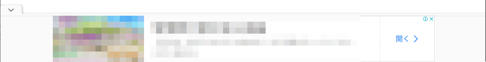
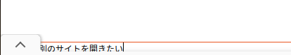
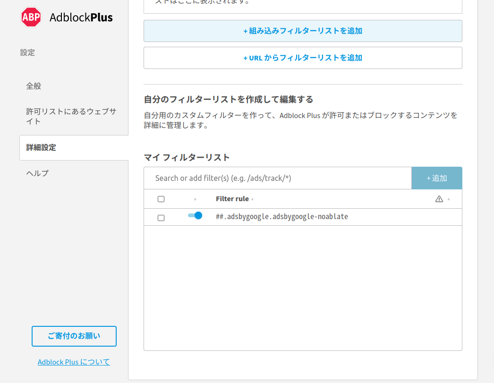

[author: T.MURACHI]
# 画面の下に生えてくるgoogle広告をフィルタリング
こんなやつ。



「v」みたいなのをクリックすれば折りたたんでくれるんだけど、それでも firefox で Vim Vixen 使ってると邪魔くさくてとても困る。



AdBlock Plus はデフォルトではこいつをブロックしてくれないが、枚フィルターリストに以下のルールを追加してあげればブロックしてくれるようになる。

```
##.adsbygoogle.adsbygoogle-noablate
```



はー、せいせいした。

多分これ z-index とかの問題だと思うんだけど、サイト上の表示がブラウザのシステムダイアログやアドオンによる表示の上におっかぶさっちゃうのはとても行儀が悪いと思うんだ。その辺、 Web 標準の文脈でもっとちゃんとルール化されるべきだと思うよ。
