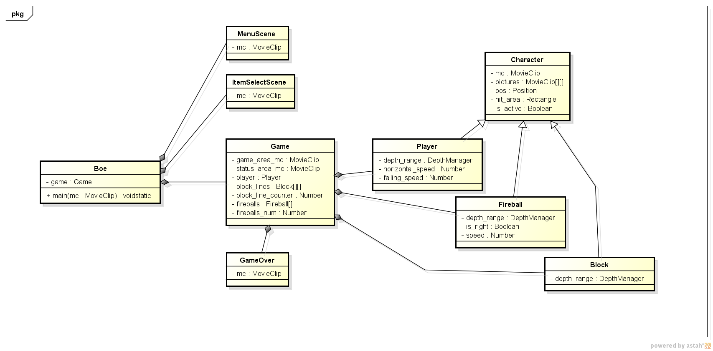

[author: murachi]
# ぼえぼえ～ for Flash Lite クラス定義

## クラス図

## 各クラスの説明

### Boe

アプリケーションクラス。画面遷移を統括する。

エントリポイントとなる main() 関数はここに記述する。

### MenuScene

メニュー画面の動作を実装するクラス。ユーザーからの入力を受け付け、 Boe オブジェクトに遷移先となる画面を決定するための情報を渡す。

### ItemSelectScene

アイテム選択画面の動作を実装するクラス。

### Game

ゲーム本体の動作を実装するクラス。フレーム更新ごとに以下の動作を繰り返す。

1. あらかじめ受け付けておいたプレイヤーの入力からプレイヤーの移動方向、速度を割り出し、プレイヤーを移動する。
  * プレイヤーの移動先の位置に関しては、ブロックの存在を考慮する。
  * 落下した分のピクセル数をスコアとしてカウントする。
1. プレイヤーがアイテムを使用していた場合は、割り当てられているキーからアイテムを削除し、アイテムアクションを実行する。
  * 既に実行中の制限時間付きアイテムアクションが時間切れになる場合は、アイテムアクションを取り消す。
1. 実存する火の玉を動かす。
  * 移動前から移動後までの位置の間に、プレイヤーの移動後の位置が重なる場合、火の玉回避アイテム発動中でないならば、ゲームオーバーフラグを立てる。
1. 画面スクロールする。
  * 必要なら最上段のブロックを削除したり、最下段のブロックを生成したりする。
  * プレイヤーの位置が画面の上下から完全にはみ出しきっている場合、
    * 上下ワープアイテム発動中なら画面上下逆から出てきた位置に移動する。
    * 上下ワープアイテム発動中でないならゲームオーバーフラグを立てる。
1. ここまでの動きを全て表示に反映させる。
1. ゲームオーバーフラグが立っているなら、ゲームを停止し、ゲームオーバーオブジェクトを生成して、ループを抜ける。

### GameOver

ゲームオーバー画面の動作を実装するクラス。ユーザーからの入力を受け付け、プログラムを終了し、ゲーム結果表示画面へ遷移する。

### Character

ゲーム中に出現するキャラクター全般を表す基本クラス。キャラクター類の実際の表示を行う処理と、当たり判定を行う処理を持つ。

### Player

ゲームのプレイヤーキャラクターを表すクラス。
