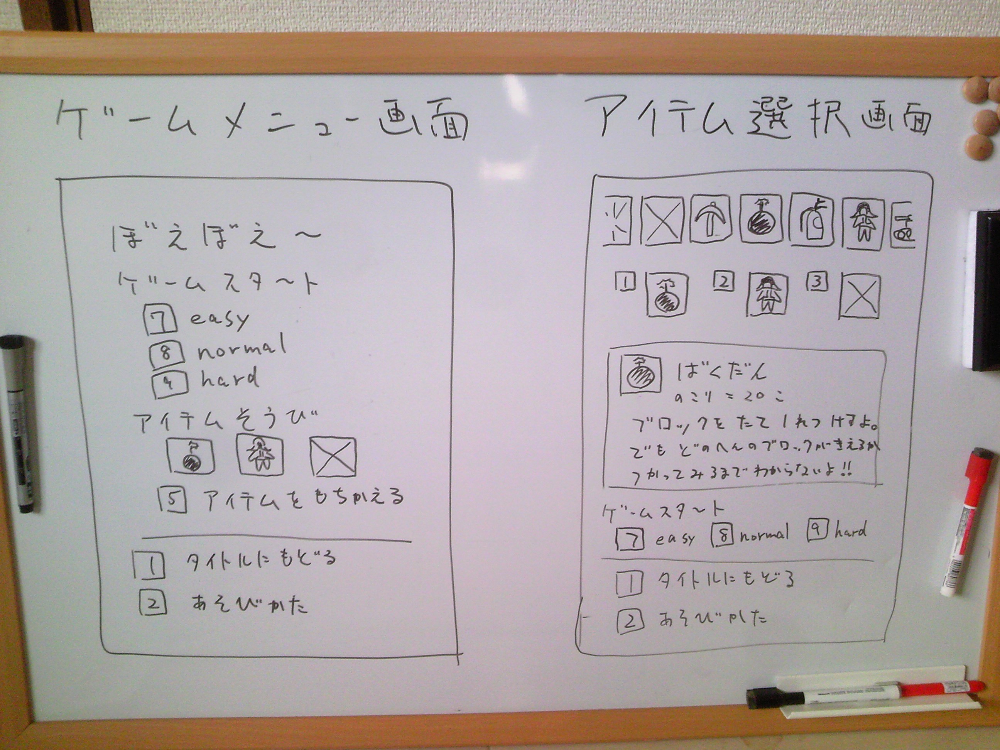

[author: murachi]
# 2010/11/30 議事録

* 開始: 12:00
* 終了: 12:20
* 参加者: murachi (村山 俊之)、 mimi (関 美津子)
* 場所: 本社開発室

## ぼえぼえ～

### タイトル画面とアイテム選択画面について

* ホーム画面 (HTML) にタイトルを表示する。
* Flash を開いて最初の画面は「ゲームメニュー画面」とし、各種案内を表示する。
* ゲームメニュー画面、アイテム選択画面のイメージをスケッチしてみた。(下図)

以上
