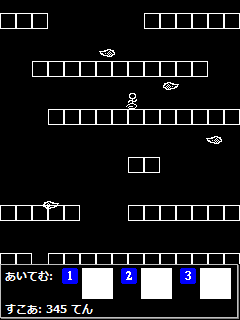

[author: murachi]
# 画面仕様

## 画面遷移図

薄赤色は HTML ページ、水色は Flash 画面。青い矩形の番号はページに割り当てられたショートカットキーで、 HTML ページからであればどこからでも飛ぶことができる。

## 各画面詳細

### ホーム画面

* URL: /
* 画面種別: HTML ページ
* 機能概要:
  * 各種リンク
  * お知らせダイジェスト表示
  * ユーザーステータス表示 (ハイスコア、ランキング、所持アイテムリスト)
* 内容:
  * タイトルバナー
  * ゲームタイトルへのリンク
  * 遊び方説明へのリンク
  * お知らせダイジェスト
    * お知らせ一覧へのリンク
  * ユーザーステータス表示
    * ハイスコア表示
    * ランキング表示
      * マイミクランキング
      * 全体ランキング
      * アイテム無しランキング
    * 所持アイテムリスト
      * アイテムショップへのリンク
  * リンクリスト
    * 「\[1] ホーム」
    * 「\[3] ゲームスタート」
    * 「\[4] アイテムショップ」
    * 「お知らせ」
    * 「遊び方」

### ゲームタイトル

* URL: /boe.swf
* 画面種別: Flash アプリ
* 機能概要:
  * タイトル表示
  * メニュー UI
* 内容:
  * タイトル表示
  * 「ゲームスタート: \[7] Easy / \[8] Normal / \[9] Hard」
  * 使用アイテム表示
  * 「\[5] ... アイテム選択変更」
  * 「\[1] ... ホームに戻る / \[2] ... 遊び方」

5, 7~9 キーを押した場合、UID からステータス情報をサーバーに問い合わせる。

使用アイテム表示は、 GET パラメータで渡された値に基づいて表示する。

### アイテム選択画面

* URL: /boe.swf
* 画面種別: Flash アプリ
* 機能概要:
  * 使用アイテム表示/変更 UI
  * アイテム説明表示
  * アイテム残数表示
* 内容:
  * \[1] ボタンに割り当てられたアイテムアイコン
  * \[2] ボタンに (以下同上)
  * \[3] ボタンに (以下同上)
  * 最後に切り替えて選択したアイテムの
    * 残数
    * 説明
  * 「ゲームスタート: \[7] Easy / \[8] Normal / \[9] Hard」
  * 「\[1] ... ホームに戻る / \[2] ... 遊び方」

1, 2, 4, 5 キーを押すと、各キーに割り当てられたアイテムのアイコンが、選択可能なものの中で順に切り替わる。アイテムを使用しないことを表す空白アイコンにも切り替わる。

7~9 キーを押した場合、新たに選択した使用アイテム情報をサーバーに送信する。

### ゲーム画面

* URL: /boe.swf
* 画面種別: Flash アプリ
* 機能概要:
  * ゲーム本体
  * 使用アイテム表示/実行 UI
  * ゲームオーバー表示
* 内容:
  * ゲーム本体
  * \[1], \[2], \[3] 各ボタンに割り当てられたアイテムアイコン
    * 使用すると、アイコンが消える。
  * ゲームオーバー表示
    * 「×　げ～む　お～ば～　×」
    * 「てんすう：xxxx てん」
    * 「決定ボタン、または \[5] キーを押してください」

ゲーム中、キャラクターは \[7] キーで左方向に、 \[8] キーで右方向に動かし、操作する。

アイテムが割り当てられたキーを押すと、そのアイテムを使用したことをサーバーに都度通知する。アイテム使用情報は、ゲーム終了後、決定ボタンまたは \[5] キーを押してゲーム結果表示画面へ遷移する際にも通知する。

ゲームプレイ中の画面は以下の通り。

プレイ画面は 240x264 pixel 。画面下にはアイテムアイコンとスコアを表示。アイテムアイコンの大きさは 32x32 pixel 。
