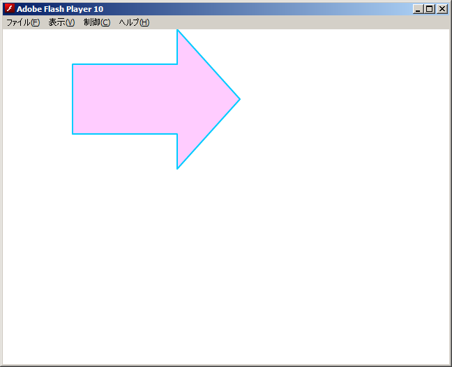

[author: murachi]
# 基本事項

ここでは、 MTASC を用いることを前提とした Action Script 2 プログラミングに関しての基本事項について触れます。

## 約束事

### 1ファイルにつき 1クラス

Action Script 2 では、 1つのスクリプトファイルにおいて記述される内容は、 1つのクラス定義のみとなります。それ以外はあり得ません。それ以外というのは具体的に、

* スクリプトファイル中にクラス定義が存在しない。
* スクリプトファイル中に複数のクラス定義が存在する。
* スクリプトファイル中にクラス定義以外のもの (裸の変数や関数、処理など) が存在する。

ということがあり得ない、という意味です。このスタイルは Java に非常によく似ており、 Java ではかつて、このことを以て「純然たる」オブジェクト指向プログラミング言語であることを主張していましたが、**まあそんなことはどうでもいいことです**。

重要なのは、新たなクラスを定義したい場合は、その都度ファイルを増やさなければならない、ということと、クラス定義以外の場所に変数や関数、ましてや生の処理などを書くことはできない、ということです。

### main() 関数

MTASC を使って Action Script 2 プログラムを作成する場合、プログラムのどこかに、エントリーポイントとなる **main() 関数**を記述する必要があります。エントリーポイントとは、要するにできあがった swf ファイルを開いたときに、まず最初に実行される関数のことです。

とりあえず、何か動くものを実際に書いてみましょう。以下のサンプルは、画面の左上隅に、"Hello, World\" という文字列を表示するだけのプログラムです。まずはこれを、 hello.as ファイルに保存してください。

```js
class Hello {
    // プログラムはこの関数から処理が始まる。
    static function main(mc:MovieClip) {
        mc.createTextField("hello_tf", 1, 0, 0, 640, 480);
        mc.hello_tf.text = "Hello, World!";
    }
}
```

ここで、このプログラムを

```js
class Hello {

// ...

}
```

で包んでやらなければいけないのは何故かというと、そういう決まりになっているから、としか言えません。内容的にはクラスにする必要のないプログラムですが、クラスとして書かないとそもそもコンパイルが通らないので、どーしよーもないのです。

このプログラムをコンパイルするには、ターミナル上で以下のコマンドを実行します。

```
$ mtasc -swf hello.swf -main -header 640:480:15 hello.as
```

mtasc コマンドのオプションについては [[MTASC チュートリアル](wiki::HowTo/MtascTutorial)を参照してください。ここでは 640x480 ピクセルサイズでフレームレートが 15fps の Flash ムービーとして、 main() 関数から処理が始まる Flash ファイル hello.swf が生成される、という内容になっています。

## ムービークリップ

Web ブラウザ上で動作する JavaScript が HTML 文書を中心に回っているとするなら、 Flash ムービー上で動作する Action Script 2 はムービーを中心に回っている、とすることができます。観念として、ムービーは複数の**ムービークリップ**がツリー状に連なって構成されており、それらのムービーに絵や文字を載せて、動かしたり、入れ替えたりすることによって、一つのムービーが表現される、という世界観です。

main() 関数に渡される引数もまた、ムービークリップです。この引数に渡されるムービークリップは、そのムービーのルートムービークリップと呼ばれるもので、グローバル変数 _root としてアクセスできるのと全く同じものです。このムービークリップをツリー構造の根っことして、その配下に新たに生成したり、読み込んだりしたムービークリップを継ぎ足していくことで、ムービーを完成させていくのです。

### テキストフィールド

最初の Hello World プログラムでは、このルートムービークリップの配下にテキストフィールドと呼ばれる部品を作り、この部品に表示する文字列を設定する、ということをやっています。

```js
    // main 関数の引数 mc にはルートムービークリップのオブジェクトが渡される。
    static function main(mc:MovieClip) {
        // ルートムービークリップの配下にテキストフィールドを作る。
        mc.createTextField("hello_tf", 1, 0, 0, 640, 480);
        // テキストフィールドに表示する文字列を設定。
        mc.hello_tf.text = "Hello, World!";
    }
```

### 空のムービークリップ

ムービークリップは、空っぽの状態で 1から作り上げることができます。図形を表示するサンプルプログラム graph-test.as を作ってみましょう。

```js
class GraphTest {
    static function main(mc:MovieClip) {
        // 空のムービークリップを生成
        mc.createEmptyMovieClip("graph_mc", 1);
        // 図形を描画する
        mc.graph_mc.lineStyle(2, 0x00ccff);
        mc.graph_mc.beginFill(0xffccff);
        mc.graph_mc.moveTo(150, 50);
        mc.graph_mc.lineTo(150, 0);
        mc.graph_mc.lineTo(240, 100);
        mc.graph_mc.lineTo(150, 200);
        mc.graph_mc.lineTo(150, 150);
        mc.graph_mc.lineTo(0, 150);
        mc.graph_mc.lineTo(0, 50);
        mc.graph_mc.endFill();
    }
}
```

コンパイルコマンドはおわかりですか? 以下のようになりますよ。

```
$ mtasc -swf graph-test.swf -main -header 640:480:15 graph-test.as
```

生成された Flash ファイルを開くと、下図のような画像が表示されます。


このプログラムでは、ルートムービークリップの配下に空のムービークリップを作成し、その空のムービークリップの中で図形の描画を行っています。こうすることで、後でこの図形を動かすことができたりします。上記のプログラムを改造し、この図形が右に 100ピクセル移動した位置に表示されるようにしてみましょう。

```js
class GraphTest {
    static function main(mc:MovieClip) {
        // 空のムービークリップを生成
        mc.createEmptyMovieClip("graph_mc", 1);
        // 図形を描画する
        mc.graph_mc.lineStyle(2, 0x00ccff);
        mc.graph_mc.beginFill(0xffccff);
        mc.graph_mc.moveTo(150, 50);
        mc.graph_mc.lineTo(150, 0);
        mc.graph_mc.lineTo(240, 100);
        mc.graph_mc.lineTo(150, 200);
        mc.graph_mc.lineTo(150, 150);
        mc.graph_mc.lineTo(0, 150);
        mc.graph_mc.lineTo(0, 50);
        mc.graph_mc.endFill();

        // 図形を右に 100ピクセル移動
        mc.graph_mc._x += 100;
    }
}
```

Flash ファイルを開き直すと、さっきよりも図形が右に表示されているのが分かるかと思います (下図)。


