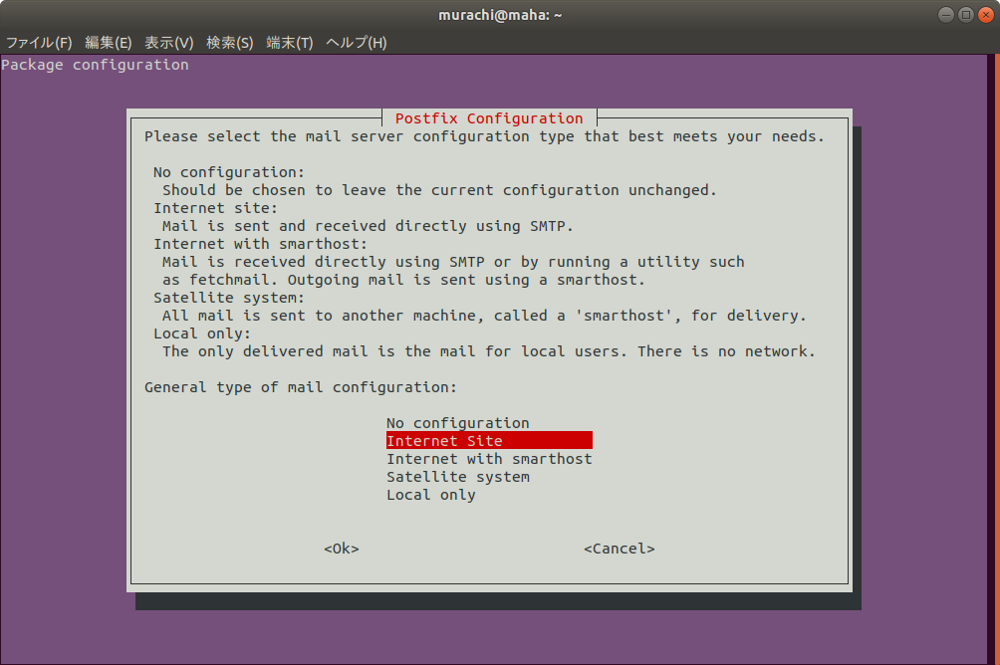

[author: murachi]
# さくらの VPS セットアップメモ 〜2G プラン据え置き Ubuntu16.04 入れ替え編〜

入れ替え、と言っても一旦別ノード契約しての実質お引越しなのですが…。

* [初回 (1G プラン + CentOS5)](wiki::HowTo/SakuraVpsSetup)
* [2回目 (2G プラン + Scientific Linux 6)](wiki::HowTo/SakuraVpsSetup2)

国際的には RedHat 系より Debian/Ubuntu の方が主流、と聞いたので、今回は Ubuntu16.04 で建ててみることにします。
個人的には Ubuntu はデスクトップ用途のイメージですが…。

## Ubuntu セットアップ

VPS コントロールパネルの「OSインストール」→「カスタムOSインストール」から、「Ubuntu16.04 amd64」を選択し、コンソール画面の内容に従って操作を進めていきました。
ディスクの区画割りで若干カスタマイズを施した以外は概ね画面の指示通りに進めただけです。詳細は省きます。

## ソフトウェアの更新

ViM を使うのであればインストールが必要です。

```console
$ sudo su -
# apt install vim
```

Ubuntu の ViM はデフォルトではコンソールのシステムエンコーディングを使ってくれない (UTF-8 のテキストでも日本語が文字化けする) ので、 `.vimrc` にエンコードを明記しておく必要がある ([参考](https:://qiita.com/meio/items/08143eacd174ac0f7bd5))。

```console
$ vim ~/.vimrc
```

```
set encoding=utf-8
set fileencodings=utf-8,sjis,iso-2022-jp,euc-jp
set fileformats=unix,dos,mac
```

`apt` コマンドでシステム全体の更新が可能です。 `update` で更新されるソフトウェアのリストを更新、 `upgrade` で実際に更新を行います。
`apt-get` ではなく `apt` を使うことで、更新によって依存関係が追加されたソフトウェアの追加インストールもやってくれるらしいです。

```console
# apt update
# apt upgrade
```

Debian/Ubuntu の場合は `aptitude` もあったほうが良いかもしれません。デフォルトでは入っていないので必要ならインストールします。

```console
# apt install aptitude
```

## ssh 接続のためのセキュリティ設定

CentOS や Scientific などと違って、セットアップが終わった段階でメインで使用するユーザーのアカウントも設定されます。普段使い用のアカウントについては自分でユーザーを作って設定する必要はありません。

sshd の設定については、設定ファイルに施す変更は初回と同様です。公開鍵認証の鍵の設定についても (dsa ではなく rsa2 を使っている以外は) 特に変わりません。
sshd のサービス名は ubuntu では `sshd` ではなく `ssh` になっています。再起動は `service` コマンドではなく `/etc/init.d` 以下のスクリプトを直接叩いたほうが良いようです (`service` コマンドではステータスがコンソールに表示されないため)。

```console
# /etc/init.d/ssh restart
```

`visudo` は不要です。なお、 `sudo` で権限昇格できるユーザーのグループは、 ubuntu では `wheel` グループではなく `sudo` グループとなっています。

## シェルのロケール設定

かなり後半の方でどハマリした orz 。 `LANG=ja_JP.UTF-8` を使用するためには `language-pack-ja` とやらをインストールしておかないといけないらしい。([参考](https:://qiita.com/mochi-grin-grin/items/ea4fa0799d016ad02c09))

```console
$ locale -a
C
C.UTF-8
POSIX
en_US
en_US.iso88591
en_US.utf8
$ sudo apt -y install language-pack-ja

...

$ locale -a
C
C.UTF-8
POSIX
en_US
en_US.iso88591
en_US.utf8
ja_JP.utf8
$
```

あとは初回と同じ。

## BIND の設定

参考: [named を chroot して動かす - いますぐ実践! Linuxシステム管理 / Vol.126](http:://www.usupi.org/sysad/126.html)

* デフォルトでは `bind9-host` はインストールされているものの、 `bind9` はインストールされていません。
* 前回の Scientific Linux 6 のときのような、 chroot 専用の BIND パッケージがあるわけではないようです。

`bind9` をインストールします。

```console
# apt install bind9
```

起動時のオプションに chroot するディレクトリを指定します。

```console
# vim /etc/default/bind9
```
```sh
# startup options for the server
OPTIONS="-u bind -t /var/named/chroot"
```

chroot 先の環境を構築します。

```console
# mkdir -p /var/named/chroot/dev
# mkdir -p /var/named/chroot/bind /var/named/chroot/var/run/bind/run /var/named/chroot/var/cache/bind /var/named/chroot/etc
# chown root.bind /var/named/chroot/var/run/bind/run
# chmod 775 /var/named/chroot/var/run/bind/run
# mknod -m 666 /var/named/chroot/dev/random c 1 8
# tar cf - -C /etc bind | tar xvfp - -C /var/named/chroot/etc
```

`dev/log` 経由で syslog にログを渡せるようにします。
Ubuntu 16.04 は rsyslog がデフォルトで入っているので、設定方法が若干異なるようです。
参考: [rsyslogを使ってsftpサーバの操作ログを出力する。 - Qiita](http:://qiita.com/tjinjin/items/f01a62db74dfd6d7db07)

```console
# vim /etc/rsyslog.d/xx-bind.conf
```
```
AddUnixListenSocket /var/named/chroot/dev/log
```

最後に、`rsyslogd` を再起動し、 `bind9` の起動を確認してひとまず完了です。

```console
# /etc/init.d/rsyslog restart
# /etc/init.d/bind9 start
# /etc/init.d/bind9 stop
```

## パケットフィルタリング設定

iptables 自体は導入済み。
設定方法については以下のサイトを参考にした。

* [Ubuntu/Ubuntuでiptablesを設定する - Welcome to Life with Linux](http:://hy.xrea.jp/linux/index.php?Ubuntu%2FUbuntu%E3%81%A7iptables%E3%82%92%E8%A8%AD%E5%AE%9A%E3%81%99%E3%82%8B)
* [iptablesによるファイアウォール構築 in Debian/Ubuntu | ホームページ制作会社 キャリーデザイン](https:://calliedesign.com/store/reference/server_setting/build_iptables_firewall_debian_ubuntu/)
* [Easy Ubuntu 16.04 Server Firewall](https:://oitibs.com/easy-ubuntu-16-server-firewall/)

1. `iptables` コマンドを呼びまくるシェルスクリプトを書いて実行する。
  * IPv4
    ```console
    $ sudo su -
    # vim iptables.sh
    ```
    ```sh
    #!/bin/sh
    
    /sbin/iptables -F
    /sbin/iptables -X
    /sbin/iptables -P INPUT ACCEPT
    /sbin/iptables -P OUTPUT ACCEPT
    /sbin/iptables -P FORWARD ACCEPT
    
    /sbin/iptables -A INPUT -m state --state ESTABLISHED,RELATED -j ACCEPT
    /sbin/iptables -A INPUT -p icmp -j ACCEPT
    /sbin/iptables -A INPUT -i lo -j ACCEPT
    
    /sbin/iptables -A INPUT -m tcp -p tcp -m state --state NEW --dport 53 -j ACCEPT
    /sbin/iptables -A INPUT -m udp -p udp -m state --state NEW --dport 53 -j ACCEPT
    /sbin/iptables -A INPUT -p tcp -m state --state NEW -m multiport --dports 22,25,587,993,80,443 -j ACCEPT
    /sbin/iptables -A INPUT -j REJECT --reject-with icmp-port-unreachable
    /sbin/iptables -A FORWARD -j REJECT --reject-with icmp-port-unreachable
    
    # SNMP blocking
    /sbin/iptables -A OUTPUT -m udp -p udp -m multiport --dports 161,162 -j REJECT --reject-with icmp-port-unreachable
    ```
    ```console
    # chmod u+x iptables.sh
    # ./iptables.sh
    ```
  * IPv6
    ```console
    # vim ip6tables.sh
    ```
    ```sh
    #!/bin/sh
    
    /sbin/ip6tables -F
    /sbin/ip6tables -X
    /sbin/ip6tables -P INPUT ACCEPT
    /sbin/ip6tables -P OUTPUT ACCEPT
    /sbin/ip6tables -P FORWARD ACCEPT
    
    /sbin/ip6tables -A INPUT -m state --state ESTABLISHED,RELATED -j ACCEPT
    /sbin/ip6tables -A INPUT -p icmp -j ACCEPT
    /sbin/ip6tables -A INPUT -i lo -j ACCEPT
    
    /sbin/ip6tables -A INPUT -m tcp -p tcp -m state --state NEW --dport 53 -j ACCEPT
    /sbin/ip6tables -A INPUT -m udp -p udp -m state --state NEW --dport 53 -j ACCEPT
    /sbin/ip6tables -A INPUT -p tcp -m state --state NEW -m multiport --dports 22,25,587,993,80,443 -j ACCEPT
    /sbin/ip6tables -A INPUT -j REJECT --reject-with icmp6-port-unreachable
    /sbin/ip6tables -A FORWARD -j REJECT --reject-with icmp6-port-unreachable
    
    # SNMP blocking
    /sbin/ip6tables -A OUTPUT -m udp -p udp -m multiport --dports 161,162 -j REJECT --reject-with icmp6-port-unreachable
    ```
    ```console
    # chmod u+x ip6tables.sh
    # ./ip6tables.sh
    ```
1. 設定内容を確認
   ```console
   # iptables -L -n
   Chain INPUT (policy ACCEPT)
   target     prot opt source               destination
   ACCEPT     all  --  0.0.0.0/0            0.0.0.0/0            state RELATED,ESTABLISHED
   ACCEPT     icmp --  0.0.0.0/0            0.0.0.0/0
   ACCEPT     all  --  0.0.0.0/0            0.0.0.0/0
   ACCEPT     tcp  --  0.0.0.0/0            0.0.0.0/0            tcp dpt:53 state NEW
   ACCEPT     udp  --  0.0.0.0/0            0.0.0.0/0            udp dpt:53 state NEW
   ACCEPT     tcp  --  0.0.0.0/0            0.0.0.0/0            state NEW multiport dports 22,25,587,993,80,443
   REJECT     all  --  0.0.0.0/0            0.0.0.0/0            reject-with icmp-port-unreachable
   
   Chain FORWARD (policy ACCEPT)
   target     prot opt source               destination
   REJECT     all  --  0.0.0.0/0            0.0.0.0/0            reject-with icmp-port-unreachable
   
   Chain OUTPUT (policy ACCEPT)
   target     prot opt source               destination
   REJECT     udp  --  0.0.0.0/0            0.0.0.0/0            udp multiport dports 161,162 reject-with icmp-port-unreachable
   # ip6tables -L -n
   Chain INPUT (policy ACCEPT)
   target     prot opt source               destination
   ACCEPT     all      ::/0                 ::/0                 state RELATED,ESTABLISHED
   ACCEPT     icmp     ::/0                 ::/0
   ACCEPT     all      ::/0                 ::/0
   ACCEPT     tcp      ::/0                 ::/0                 tcp dpt:53 state NEW
   ACCEPT     udp      ::/0                 ::/0                 udp dpt:53 state NEW
   ACCEPT     tcp      ::/0                 ::/0                 state NEW multiport dports 22,25,587,993,80,443
   REJECT     all      ::/0                 ::/0                 reject-with icmp6-port-unreachable
   
   Chain FORWARD (policy ACCEPT)
   target     prot opt source               destination
   REJECT     all      ::/0                 ::/0                 reject-with icmp6-port-unreachable
   
   Chain OUTPUT (policy ACCEPT)
   target     prot opt source               destination
   REJECT     udp      ::/0                 ::/0                 udp multiport dports 161,162 reject-with icmp6-port-unreachable
   #
   ```
1. iptables-persistent をインストールし、iptables の設定を保存する
   ```console
   # apt install iptables-persistent
   ```
  * ipv4, ipv6 の設定を保存するか尋ねられるので、両方 Yes にしておく
1. 保存内容を確認
   ```console
   # cat /etc/iptables/rules.v4
   # Generated by iptables-save v1.6.0 on Sat Apr 29 22:29:46 2017
   *filter
   :INPUT ACCEPT [0:0]
   :FORWARD ACCEPT [0:0]
   :OUTPUT ACCEPT [36:3368]
   -A INPUT -m state --state RELATED,ESTABLISHED -j ACCEPT
   -A INPUT -p icmp -j ACCEPT
   -A INPUT -i lo -j ACCEPT
   -A INPUT -p tcp -m tcp --dport 53 -m state --state NEW -j ACCEPT
   -A INPUT -p udp -m udp --dport 53 -m state --state NEW -j ACCEPT
   -A INPUT -p tcp -m state --state NEW -m multiport --dports 22,25,587,993,80,443 -j ACCEPT
   -A INPUT -j REJECT --reject-with icmp-port-unreachable
   -A FORWARD -j REJECT --reject-with icmp-port-unreachable
   -A OUTPUT -p udp -m udp -m multiport --dports 161,162 -j REJECT --reject-with icmp-port-unreachable
   COMMIT
   # Completed on Sat Apr 29 22:29:46 2017
   # cat /etc/iptables/rules.v6
   # Generated by ip6tables-save v1.6.0 on Sat Apr 29 22:29:46 2017
   *filter
   :INPUT ACCEPT [0:0]
   :FORWARD ACCEPT [0:0]
   :OUTPUT ACCEPT [0:0]
   -A INPUT -m state --state RELATED,ESTABLISHED -j ACCEPT
   -A INPUT -p icmp -j ACCEPT
   -A INPUT -i lo -j ACCEPT
   -A INPUT -p tcp -m tcp --dport 53 -m state --state NEW -j ACCEPT
   -A INPUT -p udp -m udp --dport 53 -m state --state NEW -j ACCEPT
   -A INPUT -p tcp -m state --state NEW -m multiport --dports 22,25,587,993,80,443 -j ACCEPT
   -A INPUT -j REJECT --reject-with icmp6-port-unreachable
   -A FORWARD -j REJECT --reject-with icmp6-port-unreachable
   -A OUTPUT -p udp -m udp -m multiport --dports 161,162 -j REJECT --reject-with icmp6-port-unreachable
   COMMIT
   # Completed on Sat Apr 29 22:29:46 2017
   #
   ```

設定を変更する場合は、上記のシェルを書き換えて実行した後、以下のコマンドを実行する。
```console
# /etc/init.d/netfilter-persistent save
```

留意点:
* `--reject-with` に渡すオプションは単なるエラーメッセージの種類らしい。 IPv6 では `icmp6-host-prohibited` のようなタイプは存在しなかったので、 IPv4 の方も IPv6 で使えるものと共通の `icmp[6]-port-unreachable` に揃えてみた。
* iptables-persistent については解説されているサイトの多くで `/etc/init.d/iptables-persistent` コマンドとして紹介されているが、 Ubuntu 16.04 では `/etc/init.d/netfilter-persistent` コマンドに改名されていた模様。ちょっとハマった。

## NTP 設定

ntp をインストールする必要がある。

```console
# apt install ntp
```

設定を変更。

```sh
# vim /etc/ntp.conf

# ↓この辺に、使いたい NTP サーバーを追加
# Specify one or more NTP servers.
pool ntp.nict.jp iburst
server ntp1.sakura.ad.jp

# ↓公開しないので、この辺の設定を変更
# By default, exchange time with everybody, but don't allow configuration.
#restrict -4 default kod notrap nomodify nopeer noquery limited
#restrict -6 default kod notrap nomodify nopeer noquery limited
restrict -4 default ignore
restrict -6 default ignore
```

リスタート。

```console
# /etc/init.d/ntp restart
[ ok ] Restarting ntp (via systemctl): ntp.service.
#
```

## Web サーバー設定

前回まではここで Postfix の設定をしていましたが、SSL の設定やドメイン移管が終わらなければどうせ動かせないので、今回は後回しにすることにした。
そんなわけで Web サーバーの設定。

### Apache のインストールと設定

まずは Apache をインストール。

```console
# apt install apache2
```

設定ファイルは Red Hat 系以上に分割されまくっていて、設定項目毎にファイルが別々にされてしまっている。

メインの設定ファイルは Ubuntu では以下。

```console
# vim /etc/apache2/apache2.conf
```

`Listen` だけは以下のファイルに分離している模様。

```console
# vim /etc/apache2/ports.conf
```

Server ID 系 (ServerName とか) はポート 80 のデフォルトバーチャルホストに対する設定という扱いで (それ自体はふつう)、以下のファイルに分離している。

```console
# vim /etc/apache2/sites-enabled/000-default.conf
```

設定方針としてはとりあえず以下の通り。

* 使用する予定のないモジュールは、 load しない。
* `ServerName` は `www.harapeko.jp` に。動作確認はクライアント側で hosts を設定しながら行う。
* ドキュメントルートは `/var/www/html` のままでいいや。
* .httpaccess は許容しない。 Wordpress を動かすのに必要な設定は `<Location>` に対して施す。
* ディレクトリ index も許容しない。
* 日本語を優先する。デフォルトの文字セットは off にしていたが、 UTF-8 を使用する設定に変更する。
* 従来はアクセスログもエラーログもバーチャルホスト毎に別ファイルで出力していたが、 Ubuntu ではデフォルトの設定を活かして以下の通りに設定する。
  * アクセスログは www のみを通常の access.log ファイルに出力し、それ以外のバーチャルホストについては、バーチャルホスト名を含めた形式の内容で 1つのファイル (other_vhosts_access.log) にまとめる (Ubuntu のデフォルト設定を踏襲)。
  * エラーログは、当面は Trac を動かしている developer と Wordpress を動かしている blog だけ別ファイルに切り分け、他はすべて混ぜる (他のバーチャルホストでプログラマブルなことをやる場合でエラーログを分けたくなったら適宜設定を追加する)。

そうなると、まず /etc/apache2 直下にある apache2.conf と ports.conf については変更を加える箇所は特に無い。

次に /etc/apache2/conf-enabled の下にあるファイルをチェック。

```console
# cd /etc/apache2/conf-enabled
# vim charset.conf
```

```apache
# コメントアウトを外す
AddDefaultCharset UTF-8
```

CGI は使う予定ないので conf-enabled/serve-cgi-bin.conf は消してしまう。どうせシンボリックリンクだし欲しくなったらいつでも戻せる。

```console
# rm serve-cgi-bin.conf
```

次に、 /etc/apache2/mods-enabled 配下をチェック。

```console
# cd ../mods-enabled
# ls *.load
access_compat.load  authn_file.load  autoindex.load  filter.load       setenvif.load
alias.load	    authz_core.load  deflate.load    mime.load	       status.load
auth_basic.load     authz_host.load  dir.load	     mpm_event.load
authn_core.load     authz_user.load  env.load	     negotiation.load
```

以前のサーバーで使っていないモジュールは削除。
…と言いたいところなんだけど、実際不要だと思えるモジュールがなかなかない。以下、わかりやすさのため、箇条書きで。
* `mod_status` はステータス画面を見るためのもので通常 localhost からしか見ないものなので必要なとき以外はなしでいいかなという感じなんだけど、
* 例えば `mod_filter` は 2.4 では deflate したい場合はセットで使ったほうが良さげだったりするので念の為残した。

```console
# rm status.*
```

* 逆に `mod_authz_owner` は前回は有効にしてたけど、すぐに必要がどうかはちょっとまだ見極められないので無効のまま。
* `mod_mime_magic` も前回は有効にしてたけど、サーバー負荷が重くなるだけだからやめておいたほうが良いみたいな情報もあったりするので同じく無効のまま。
* `mod_expires` は前回は有効にしておきながら設定らしい設定をしていなかったのでこれも無効のまま (でも本当はちゃんと設定してあげたほうが良さげ)、`mod_headers` も同様。
* `mod_dav` は使うので追加。 `DavLockDB` も使うので `mod_dav_fs` も追加 (.conf ファイルは内容的にもしかしたら要らんかも…)。
* `mod_vhost_alias` も追加 (何でこれ無いの? っちゅーくらい Virtual Host 使うなら絶対必須なやつ)。
* `mod_rewrite` も一応追加 (WordPress でパーマネントリンク設定をディレクトリ形式にする場合は必須… WordPress 捨てたいけどすぐには捨てられないからね 'A`)。
* `mod_cgi` は… 多分要らんやろ…。

```console
# ln -s ../mods-available/dav.load
# ln -s ../mods-available/dav_fs.load
# ln -s ../mods-available/dav_fs.conf
# ln -s ../mods-available/vhost_alias.load
# ln -s ../mods-available/rewrite.load
```

最後に /etc/apache2/sites-* シリーズをチェック。 sites-available の下を見ると sites-enabled には無いものとして default-ssl.conf というのがあるけど、これは後で SSL 証明書のセットアップをするときに設定することにするとして、とりあえず今は後回しにする。

/etc/apache2/000-default.conf を編集。

```console
# cd ../sites-enabled
# vim 000-defailt.conf
```

```
<VirtualHost *:80>
        # サーバー名を設定 (コメントアウトを外して修正)
        ServerName www.harapeko.jp

        # Admin メアドは以下で統一
        ServerAdmin root@harapeko.jp
        DocumentRoot /var/www/html

        # ErrorLog, CustomLog はデフォルト設定のまま
</VirtualHost>
```

その他のヴァーチャルホストについては、以下のようなスクリプトを書いて対応…。

```console
# vim a.pl
```

```perl
#!/usr/bin/perl
for my $site (@ARGV) {
    open my $fh, '>', "$site.conf";
    print $fh <<ENDLINE;
<VirtualHost *:80>
    ServerAdmin root\@harapeko.jp
    DocumentRoot /var/www/vhosts/$site/html
    ServerName $site.harapeko.jp

    IncludeOptional sites-enabled/$site/*.conf
</VirtualHost>
ENDLINE

    mkdir $site, 0755;
}
```

```console
# chmod u+x a.pl
# ./a.pl blog daiyokujo developer test
perl: warning: Setting locale failed.
perl: warning: Please check that your locale settings:
	LANGUAGE = "en_US:",
	LC_ALL = (unset),
	LANG = "ja_JP.UTF-8"
    are supported and installed on your system.
perl: warning: Falling back to the standard locale ("C").
# ls -l
total 36
lrwxrwxrwx 1 root root   35 May 27 06:36 000-default.conf -> ../sites-available/000-default.conf
-rwxr--r-- 1 root root  328 Aug 10 16:00 a.pl
drwxr-xr-x 2 root root 4096 Aug 10 16:00 blog
-rw-r--r-- 1 root root  189 Aug 10 16:00 blog.conf
drwxr-xr-x 2 root root 4096 Aug 10 16:00 daiyokujo
-rw-r--r-- 1 root root  204 Aug 10 16:00 daiyokujo.conf
drwxr-xr-x 2 root root 4096 Aug 10 16:00 developer
-rw-r--r-- 1 root root  204 Aug 10 16:00 developer.conf
drwxr-xr-x 2 root root 4096 Aug 10 16:00 test
-rw-r--r-- 1 root root  189 Aug 10 16:00 test.conf
#
```

### サブドメインごとの設定

#### www

`/var/www/html` の権限が root:root になっているのを修正する。

Ubuntu での apache の実行ユーザーは `/etc/apache2/envvars` に `APACHE_RUN_USER` および `APACHE_RUN_GROUP` として設定されている。

```console
# less /etc/apache2/envvars
```

```
# Since there is no sane way to get the parsed apache2 config in scripts, some
# settings are defined via environment variables and then used in apache2ctl,
# /etc/init.d/apache2, /etc/logrotate.d/apache2, etc.
export APACHE_RUN_USER=www-data
export APACHE_RUN_GROUP=www-data
```

そこで、ドキュメントディレクトリの権限を `murachi:www-data` に変更する。

```console
# cd /var/www/html
# ls -la
total 20
drwxr-xr-x 2 root root  4096 May 27  2017 .
drwxr-xr-x 3 root root  4096 May 27  2017 ..
-rw-r--r-- 1 root root 11321 May 27  2017 index.html
# chown -R murachi:www-data .
# chmod g+s .
# ls -la
total 20
drwxr-sr-x 2 murachi www-data  4096 May 27  2017 .
drwxr-xr-x 3 root    root      4096 May 27  2017 ..
-rw-r--r-- 1 murachi www-data 11321 May 27  2017 index.html
#
```

もはや index.html は不要だ、消してしまおう。

```console
$ cd /var/www/html/
$ rm index.html
```

そして代わりに旧サーバーにログインし、ここに置くべきファイルを rsync してあげる。

```console
$ rsync -rlpte ssh /var/www/htdocs/* murachi@153.126.157.107:/var/www/html/
Enter passphrase for key '/home/murachi/.ssh/id_rsa':
$
```

動かすには生意気にも PHP が必要だ。

```console
$ sudo apt -y install php libapache2-mod-php

...

$ sudo /etc/init.d/apache2 restart
[ ok ] Restarting apache2 (via systemctl): apache2.service.
$
```

hosts に www.harapeko.jp だけ設定してアクセスしたらちゃんと動いているのを確認できた。

#### blog

PHP はもう入れたので、あとは MySQL ですね。

…違った、Ubuntu だから mariadb なのか。

それと PHP で使うライブラリも一緒に入れちゃいます (mbstring とか今でも必要なんじゃろか…)。

```console
$ sudo apt -y install mariadb-server mariadb-client php-mysql php-mbstring

...

$
```

my.cnf はデフォルトで色々と設定が施されていて、ファイルも細分化されている。文字コードの設定は、

```console
$ sudo vim /etc/mysql/mariadb.conf.d/50-server.cnf
```

の中に、

```
#
# * Character sets
#
# MySQL/MariaDB default is Latin1, but in Debian we rather default to the full
# utf8 4-byte character set. See also client.cnf
#
character-set-server  = utf8mb4
collation-server      = utf8mb4_general_ci
```

として指定済み (`50-client.cnf`, `50-mysql-clients.cnf` にもそれぞれ設定があった)。以前と違って `utf8mb4` が指定されていて、サロゲートペアの扱いが異なるので若干不安はあるが、とりあえずこれで強行してみることにする (問題ないならこの設定のほうが圧倒的に良好)。

ちなみに root ユーザーで mariadb に接続するには、 `sudo` を使用する。UNIX_SOCKET Authentication plugin というのが有効になっていて、 root ユーザーは linux の root ユーザーの権限に紐付けられているらしい (mariadb 用のパスワードを別途用意する必要がない)。 ([参考](https:://jyn.jp/ubuntu-16-04-mariadb-password-bug/))

```
$ sudo mysql -u root
```

WordPress を置く場所を作りましょう。

```console
$ sudo mkdir -p /var/www/vhosts/blog/html
$ sudo chown murachi:www-data /var/www/vhosts/blog/html
$ sudo chmod g+s /var/www/vhosts/blog/html
$ ls -la /var/www/vhosts/blog/html
total 8
drwxr-sr-x 2 murachi www-data 4096 Oct 23 15:54 .
drwxr-xr-x 3 root    root     4096 Oct 23 15:54 ..
$
```

そしたら旧サーバーの `/var/www/vhosts/blog/htdocs/*` を、新サーバーの `/var/www/vhosts/blog/html/` に転送します。(旧サーバーから実行)

```console
$ rsync -rlpte ssh /var/www/vhosts/blog/htdocs/* murachi@153.126.157.107:/var/www/vhosts/blog/html/
Enter passphrase for key '/home/murachi/.ssh/id_rsa':
$
```

更には旧サーバーの DB を新サーバーにコピーします。(新サーバーのファイル転送先ディレクトリはあらかじめ作っておく)

* 旧サーバー
  ```console
  $ cd ~/tempsql
  $ rm *
  $ mysqldump -u harapeko_press -p harapeko_press > harapeko_press.sql
  Enter password:
  $ rsync -e ssh harapeko_press.sql murachi@153.126.157.107:/home/murachi/tempsql/
  Enter passphrase for key '/home/murachi/.ssh/id_rsa':
  $
  ```
* 新サーバー
  ```console
  $ cd ~/tempsql
  $ sudo mysql -u root
  [sudo] password for murachi:
  Welcome to the MariaDB monitor.  Commands end with ; or \g.
  Your MariaDB connection id is 48
  Server version: 10.0.36-MariaDB-0ubuntu0.16.04.1 Ubuntu 16.04
  
  Copyright (c) 2000, 2018, Oracle, MariaDB Corporation Ab and others.
  
  Type 'help;' or '\h' for help. Type '\c' to clear the current input statement.
  
  MariaDB [(none)]>
  MariaDB [(none)]> create database harapeko_press;
  Query OK, 1 row affected (0.00 sec)
  
  MariaDB [(none)]> grant all privileges on harapeko_press.* to harapeko_press@localhost identified by '(パスワード)';
  Query OK, 0 rows affected (0.02 sec)
  
  MariaDB [(none)]> quit
  Bye
  $ mysql -u harapeko_press -p harapeko_press < harapeko_press.sql
  Enter password:
  $
  ```

最後に念の為 apache を再起動。

```console
$ sudo /etc/init.d/apache2 restart
[sudo] password for murachi:
[ ok ] Restarting apache2 (via systemctl): apache2.service.
$
```

hosts を書き換えてアクセス…するも何も表示されず orz

エラーログが吐かれているようなので確認。

```console
# cd /var/log/apache2/
# ls
access.log	  access.log.14.gz  access.log.7.gz  error.log.10.gz  error.log.3.gz  error.log.9.gz
access.log.1	  access.log.2.gz   access.log.8.gz  error.log.11.gz  error.log.4.gz  other_vhosts_access.log
access.log.10.gz  access.log.3.gz   access.log.9.gz  error.log.12.gz  error.log.5.gz
access.log.11.gz  access.log.4.gz   blog-error.log   error.log.13.gz  error.log.6.gz
access.log.12.gz  access.log.5.gz   error.log	     error.log.14.gz  error.log.7.gz
access.log.13.gz  access.log.6.gz   error.log.1      error.log.2.gz   error.log.8.gz
# tail -n 10 blog-error.log
[Tue Oct 23 17:02:11.977652 2018] [:error] [pid 10976] [client 183.76.71.3:41234] PHP Parse error:  syntax error, unexpected 'new' (T_NEW) in /var/www/vhosts/blog/html/wp-content/plugins/wp-hatena/wp-hatena.php on line 44
[Tue Oct 23 17:02:19.994016 2018] [:error] [pid 10976] [client 183.76.71.3:41252] PHP Parse error:  syntax error, unexpected 'new' (T_NEW) in /var/www/vhosts/blog/html/wp-content/plugins/wp-hatena/wp-hatena.php on line 44
#
```

なんとなーくいじったような覚えのあるファイル名で syntax error('A`)

直します。

```console
$ vim /var/www/vhosts/blog/html/wp-content/plugins/wp-hatena/wp-hatena.php
```

```php
/******************************************************************************
 * WpHatena function define.
 *****************************************************************************/
if(class_exists('WpHatena')) {

        # PHP7.1 以降、クラスオブジェクトを参照演算子を使って代入する書き方は禁止された模様…。
        # $wph = & new WpHatena();
        $wph = new WpHatena();

# ...

```

修正後、再度アクセスを試みたところ、無事動いてくれました。わーい。

…個別のページで 404 になりますね orz 。

そうそう、 `.htaccess` を拒否しているんでした。設定を書き加えねば。

```console
$ sudo vim /etc/apache2/sites-enabled/blog/wp.conf
```

`.htaccess` に元々書いていた内容を、まんま `<Directory>` ディレクティブに包んで書き写せばおｋ。

```
<Directory "/var/www/vhosts/blog/html">
        <IfModule mod_rewrite.c>
        RewriteEngine On
        RewriteBase /
        RewriteRule ^index\.php$ - [L]
        RewriteCond %{REQUEST_FILENAME} !-f
        RewriteCond %{REQUEST_FILENAME} !-d
        RewriteRule . /index.php [L]
        </IfModule>

        # xmlrpc.php へのアクセスを遮断
        <Files "xmlrpc.php">
        order deny,allow
        deny from all
        </Files>
</Directory>
```

これで個別のページも見れるようになりました (もちろん apache の restart も忘れずに…)。

#### developer

とりあえず HTTPS じゃない方の trac だけ動かせるようにします。さすがに apt に trac は入っていないようなので、導入方法は前回とほぼ同じになるはず。

##### trac のセットアップ

python は 2.7.12 と 3.5.2 がインストール済み (通常コマンドは 2.7.12、 `python3` コマンドが 3.5.2)。

trac の stable version は現在 1.2 で、python の対象バージョンは 2.6 or 2.7 らしい。いつになったら 3 に対応するのやら… まぁいいや。

今回は pip コマンドを使いましょう。…デフォルトで入ってなかった orz

pip コマンド自体をまずはインストール。 (どうせ後で欲しくなるので python3 用のも入れとく)

```console
$ sudo apt -y install python-pip python3-pip
```

じゃんじゃん入れていきましょう。

```console
$ sudo pip install Genshi Babel Docutils Pygments pytz
Traceback (most recent call last):
  File "/usr/bin/pip", line 11, in <module>
    sys.exit(main())
  File "/usr/lib/python2.7/dist-packages/pip/__init__.py", line 215, in main
    locale.setlocale(locale.LC_ALL, '')
  File "/usr/lib/python2.7/locale.py", line 581, in setlocale
    return _setlocale(category, locale)
locale.Error: unsupported locale setting
$
```

ん? ロケール設定がサポート外とな?

[この辺](https:://stackoverflow.com/questions/36394101/pip-install-locale-error-unsupported-locale-setting)を見る限り、 `LC_ALL` 環境変数が設定されていればいいっぽい。

```console
$ vim ~/.bash_profile
```

```
export LANG=ja_JP.UTF-8
export LC_ALL=C
```

```console
$ source ~/.bash_profile
$ sudo pip install Genshi Babel Docutils Pygments pytz
```

おー、行った行った。

```console
...

You are using pip version 8.1.1, however version 18.1 is available.
You should consider upgrading via the 'pip install --upgrade pip' command.
$
```

などと注意されちゃったので、pip のバージョンも上げておきます。

```console
$ sudo pip install --upgrade pip
```

FootNoteMacro は、[公式サイト](https:://trac-hacks.org/wiki/FootNoteMacro)によれば `easy_install` から入れられるようになってるっぽい。

```console
$ sudo easy_install https://trac-hacks.org/svn/footnotemacro/
Downloading https://trac-hacks.org/svn/footnotemacro/
Doing subversion checkout from https://trac-hacks.org/svn/footnotemacro/ to /tmp/easy_install-8bAZFq/__downloaded__
sh: 1: svn: not found
Processing __downloaded__
error: Couldn't find a setup script in /tmp/easy_install-8bAZFq/__downloaded__
$
```

おいおい Subversion 入ってないのかよこの鯖… (´･_･`)

```console
$ sudo apt -y install subversion

...

$ sudo easy_install https://trac-hacks.org/svn/footnotemacro/

...

Installed /usr/local/lib/python2.7/dist-packages/Trac-1.2.3-py2.7.egg
Finished processing dependencies for TracFootNoteMacro==1.6
$
```

入りました。

それでは最後に trac を… こうでいいのかな?

```console
$ sudo pip install trac
The directory '/home/murachi/.cache/pip/http' or its parent directory is not owned by the current user and the cache has been disabled. Please check the permissions and owner of that directory. If executing pip with sudo, you may want sudo's -H flag.
The directory '/home/murachi/.cache/pip' or its parent directory is not owned by the current user and caching wheels has been disabled. check the permissions and owner of that directory. If executing pip with sudo, you may want sudo's -H flag.
Requirement already satisfied: trac in /usr/local/lib/python2.7/dist-packages/Trac-1.2.3-py2.7.egg (1.2.3)
Requirement already satisfied: setuptools>=0.6 in /usr/lib/python2.7/dist-packages (from trac) (20.7.0)
Requirement already satisfied: Genshi>=0.6 in /usr/local/lib/python2.7/dist-packages (from trac) (0.7.1)
$
```

ん? 入ったの? これ…??

…どうやら FootNoteMacro をインストールした際に trac も一緒に入れてくれちゃっていた模様。実はインストールする順番間違ってたのね…(汗

##### データの移行

リポジトリのファイルを取り込むディレクトリを用意。

```console
$ sudo mkdir -p /var/Developer
$ sudo chown murachi:www-data /var/Developer/
$ ls -la /var/Developer/
total 8
drwxr-xr-x  2 murachi www-data 4096 Oct 23 21:03 .
drwxr-xr-x 14 root    root     4096 Oct 23 21:03 ..
$ sudo chmod g+s /var/Developer/
$ ls -la /var/Developer/
total 8
drwxr-sr-x  2 murachi www-data 4096 Oct 23 21:03 .
drwxr-xr-x 14 root    root     4096 Oct 23 21:03 ..
$
```

旧サーバーのリポジトリファイルを転送 (旧サーバーから)

```console
$ rsync -rlpte ssh /var/Developer/* murachi@153.126.157.107:/var/Developer/
```

次に MySQL のデータを。まずは旧サーバーで dump

```console
$ cd ~/tempsql
$ mysqldump -u trac_master -p --databases trac_boeboe trac_erk_board trac_ideanote trac_muzplay trac_nursing_tools trac_otoco trac_paynote trac_specbuilder trac_test_doc trac_test_src > trac_all.sql
$ rsync -e ssh trac_all.sql murachi@153.126.157.107:/home/murachi/tempsql/
```

それを新サーバーに import

```console
$ cd ~/tempsql
$ sudo mysql -u root < trac_all.sql
$ sudo mysql -u root

mysql> grant all privileges on trac_boeboe.* to trac_master@localhost identified by 'パスワード';
mysql> grant all privileges on trac_erk_board.* to trac_master@localhost;
mysql> grant all privileges on trac_ideanote.* to trac_master@localhost;
mysql> grant all privileges on trac_muzplay.* to trac_master@localhost;
mysql> grant all privileges on trac_nursing_tools.* to trac_master@localhost;
mysql> grant all privileges on trac_otoco.* to trac_master@localhost;
mysql> grant all privileges on trac_paynote.* to trac_master@localhost;
mysql> grant all privileges on trac_specbuilder.* to trac_master@localhost;
mysql> grant all privileges on trac_test_doc.* to trac_master@localhost;
mysql> grant all privileges on trac_test_src.* to trac_master@localhost;
mysql> quit
```

##### WSGI 設定

WSGI スクリプト周りはすでに記述済みなので、 apache 側の設定だけ。

```console
$ sudo vim /etc/apache2/sites-enabled/developer/trac.conf
```

```
<IfModule mod_wsgi.c>
  WSGIScriptAlias /trac/original /var/Developer/trac/original/trac-original.wsgi
  WSGIScriptAlias /trac/projects/test /var/Developer/trac/projects/test/trac-test.wsgi

  <Directory /var/Developer/trac/original>
    WSGIApplicationGroup %{GLOBAL}
    Order deny,allow
    Allow from all
  </Directory>

  <Directory /var/Developer/trac/projects/test>
    WSGIApplicationGroup %{GLOBAL}
    Order deny,allow
    Allow from all
  </Directory>

  <Location /trac/original/otoco/login>
    AuthType Digest
    AuthName realm
    AuthUserFile "/var/Developer/trac/original/otoco/.htdigest"
    Require valid-user
  </Location>

  <Location /trac/original/ideanote/login>
    AuthType Digest
    AuthName realm
    AuthUserFile "/var/Developer/trac/original/ideanote/.htdigest"
    Require valid-user
  </Location>

  # ... (以下、似たような設定が続く)

</IfModule>
```

そして apache を再起動。

```console
$ sudo /etc/init.d/apache2 restart
```

…あれ、404 ですね orz

##### trac 環境のアップグレード

そうか、 `trac-admin` から upgrade してあげないといけないんだった。

で、やってあげようとすると mysql がどうのこうのと怒られる。[この辺](https:://trac.edgewall.org/wiki/MySqlDb)によると、 MySQL-python を入れてあげないといけないっぽい。

```console
$ sudo pip install MySQL-python
[sudo] password for murachi:
The directory '/home/murachi/.cache/pip/http' or its parent directory is not owned by the current user and the cache has been disabled. Please check the permissions and owner of that directory. If executing pip with sudo, you may want sudo's -H flag.
The directory '/home/murachi/.cache/pip' or its parent directory is not owned by the current user and caching wheels has been disabled. check the permissions and owner of that directory. If executing pip with sudo, you may want sudo's -H flag.
Collecting MySQL-python
  Downloading https://files.pythonhosted.org/packages/a5/e9/51b544da85a36a68debe7a7091f068d802fc515a3a202652828c73453cad/MySQL-python-1.2.5.zip (108kB)
    100% |################################| 112kB 1.8MB/s
    Complete output from command python setup.py egg_info:
    sh: 1: mysql_config: not found
    Traceback (most recent call last):
      File "<string>", line 1, in <module>
      File "/tmp/pip-install-99Zjnt/MySQL-python/setup.py", line 17, in <module>
        metadata, options = get_config()
      File "/tmp/pip-install-99Zjnt/MySQL-python/setup_posix.py", line 43, in get_config
        libs = mysql_config("libs_r")
      File "/tmp/pip-install-99Zjnt/MySQL-python/setup_posix.py", line 25, in mysql_config
        raise EnvironmentError("%s not found" % (mysql_config.path,))
    EnvironmentError: mysql_config not found

    ----------------------------------------
Command "python setup.py egg_info" failed with error code 1 in /tmp/pip-install-99Zjnt/MySQL-python/
$
```

`mysql_config` って何だ?

…結局[開発用パッケージも必要](https:://stackoverflow.com/questions/5178292/pip-install-mysql-python-fails-with-environmenterror-mysql-config-not-found)ってことらしい。

```console
$ sudo apt -y install libmysqlclient-dev

...

$ sudo pip install MySQL-python
```

うん、今度はちゃんと入った。

気を取り直して、とりあえず ideanote の環境を upgrade

```console
$ cd /var/Developer/trac/original/ideanote
$ trac-admin .
trac-admin 1.2.3 ?????
Trac ???????(?????)???
Copyright (C) 2003-2018 Edgewall Software

'?' ????? 'help' ???????????????

Trac [/var/Developer/trac/original/ideanote]> upgrade
???????????????????????????????????

TracError: ???????????????????????? InnoDB ??? NDB ???????????????????????????????????????????????????????????????: attachment, auth_cookie, cache, component, enum, milestone, node_change, permission, report, repository, revision, session, session_attribute, system, ticket, ticket_change, ticket_custom, version, wiki
Trac [/var/Developer/trac/original/ideanote]>
```

今度は InnoDB じゃないぞって怒られてしまった… 旧 DB は MyISAM だったってこと? まじかー

* [MySQL and its MySQLdb Python bindings](https:://trac.edgewall.org/wiki/MySqlDb)

↑を参考に、MyISAM になっているテーブルを InnoDB に変換する。

```
MariaDB [trac_ideanote]> select table_name, engine from information_schema.tables where table_schema = database();
+-------------------+--------+
| table_name        | engine |
+-------------------+--------+
| attachment        | MyISAM |
| auth_cookie       | MyISAM |
| cache             | MyISAM |
| component         | MyISAM |
| enum              | MyISAM |
| milestone         | MyISAM |
| node_change       | MyISAM |
| permission        | MyISAM |
| report            | MyISAM |
| repository        | MyISAM |
| revision          | MyISAM |
| session           | MyISAM |
| session_attribute | MyISAM |
| system            | MyISAM |
| ticket            | MyISAM |
| ticket_change     | MyISAM |
| ticket_custom     | MyISAM |
| version           | MyISAM |
| wiki              | MyISAM |
+-------------------+--------+
19 rows in set (0.02 sec)

MariaDB [trac_ideanote]> alter table attachment engine = InnoDB;
Query OK, 38 rows affected (0.13 sec)
Records: 38  Duplicates: 0  Warnings: 0

MariaDB [trac_ideanote]> alter table auth_cookie engine = InnoDB;
Query OK, 1 row affected (0.02 sec)
Records: 1  Duplicates: 0  Warnings: 0

MariaDB [trac_ideanote]> alter table cache engine = InnoDB;
Query OK, 1 row affected (0.01 sec)
Records: 1  Duplicates: 0  Warnings: 0

...

MariaDB [trac_ideanote]> alter table wiki engine = InnoDB;
Query OK, 516 rows affected (0.15 sec)
Records: 516  Duplicates: 0  Warnings: 0

MariaDB [trac_ideanote]> quit
Bye
```

で、もう一度 upgrade を試すが…

```
Trac [/var/Developer/trac/original/ideanote]> upgrade
アップグレードが失敗しました。問題を解消させてもう一度試してください。

TracError: すべてのテーブルは照合順序として utf8_bin または utf8mb4_bin で作成されている必要があります。次のテーブルがその照合順序で作成されていません: attachment, auth_cookie, cache, component, enum, milestone, node_change, permission, report, repository, revision, session, session_attribute, system, ticket, ticket_change, ticket_custom, version, wiki
Trac [/var/Developer/trac/original/ideanote]>
```

今度は照合順序ですか…


## メールサーバー移行

ひとまず先にメールサーバーの移行を済ませることにする。

### 旧サーバーのメールサーバーを停止

新しいメールサーバーのホスト名は `mail.harapeko.jp` にしてしまうことにする。そこで、旧サーバーの BIND のゾーン設定を以下の通りに変更した。

```
$TTL    1D
@               IN      SOA     onaka.harapeko.jp. root.onaka.harapeko.jp. (
                        2019050201      ; serial
                        3600            ; refresh 1h
                        900             ; retry 15m
                        3600000         ; expiry 1000h
                        3600            ; minimum 24h
                )
;
                IN      NS      ns.harapeko.jp.
                IN      MX      0 mail.harapeko.jp.
mail            IN      MX      0 mail.harapeko.jp.
onaka           IN      A       49.212.128.142
ns              IN      A       49.212.128.142
mail            IN      A       153.126.157.107
www             IN      CNAME   onaka
daiyokujo       IN      CNAME   onaka   ; for harapeko.asablo.jp/blog
blog            IN      CNAME   onaka
developer       IN      CNAME   onaka
svn             IN      CNAME   onaka
test            IN      CNAME   onaka
```

以前は MX レコードに `developer` を置いていたが、これを `mail` に変更。 `*` は削除し、 `(user id)@harapeko.jp` または `(user id)@mail.harapeko.jp` 以外は届かないことにする。そして `mail` を CNAME レコードから A レコードへ移し、新サーバーのアドレスを割り当てた。

~~どうせこの設定が世に広まるまでに時間はかかるだろうから~~(←浸透いうなｗ)、まずはこいつを BIND に reload し、ついでに Postfix を落としてしまった。

```console
# service named reload
# service postfix stop
# service dovecot stop
```

※ 実際のところ、手元のルーターには割とすぐに設定が反映されました。いい時代になった…。

### SSL 証明書発行

Let's Encrypt を使用します。こいつの導入は git を使います。

```console
$ sudo apt install git

...

$ git clone https://github.com/certbot/certbot

...

$ cd certbot
```

とりあえず証明したいのは `mail.harapeko.jp` ドメインのみ。 Web ページを作成する予定はないので、 Apache の設定はスキップしてスタンドアローンで証明書のみ発行してしまいます。 80番ポートを listen できる必要があるので Apache は一旦止めます。

```console
$ sudo service apache2 stop
$ ./certbot-auto certonly --standalone -d mail.harapeko.jp
```

途中色々と聞かれるので適当に応答します (Yes/No とかメールアドレスとか)。最終的にこんなメッセージが出てきます。

```
IMPORTANT NOTES:
 - Congratulations! Your certificate and chain have been saved at:
   /etc/letsencrypt/live/mail.harapeko.jp/fullchain.pem
   Your key file has been saved at:
   /etc/letsencrypt/live/mail.harapeko.jp/privkey.pem
   Your cert will expire on 2019-07-31. To obtain a new or tweaked
   version of this certificate in the future, simply run certbot-auto
   again. To non-interactively renew *all* of your certificates, run
   "certbot-auto renew"
```

### ユーザーアカウントの引き継ぎ

[前回とほぼ同じことをやりました](http:://developer.harapeko.jp/trac/original/ideanote/wiki/HowTo/SakuraVpsSetup2#%E3%83%A6%E3%83%BC%E3%82%B6%E3%83%BC%E3%82%A2%E3%82%AB%E3%82%A6%E3%83%B3%E3%83%88%E3%81%AE%E5%BC%95%E3%81%8D%E7%B6%99%E3%81%8E)。ついでにもはや使われていないいくつかのユーザーアカウントを抹消。

ちなみに、ログインできないアカウントの登録は Ubuntu では以下のように、 `/sbin/nologin` ではなく `/usr/sbin/nologin` を指定する。

```console
$ sudo useradd -ms /usr/sbin/nologin toshiyuki.murayama
```

そして、これらのアカウントに変更するには、一旦 root を経由する必要がある。

```console
$ sudo su -
# su -s /bin/bash toshiyuki.murayama

(アカウントを借りてコマンドを発行したいだけであれば sudo -u を使えばいい)
$ sudo -u toshiyuki.murayama any-command -options...
```

また、メールの受信方式を IMAP に変更していたので、今回はメールボックスの移行も行いました。

```console
$ su -s /bin/bash toshiyuki.murayama
$ cd
$ tar -cJvf toshiyuki.murayama.Maildir.tar.xz Maildir

...

$ exit
$ sudo mv /home/toshiyuki.murayama.Maildir.tar.xz .
$ rsync -az toshiyuki.murayama.Maildir.tar.xz mitsuko.seki.Maildir.tar.xz -e ssh mail.harapeko.jp:~/
$ ssh mail.harapeko.jp
$ sudo chown toshiyuki.murayama:toshiyuki.murayama toshiyuki.murayama.Maildir.tar.xz
$ sudo mv toshiyuki.murayama.Maildir.tar.xz /home/toshiyuki.murayama/
$ sudo su -
# su -s /bin/bash toshiyuki.murayama
$ cd
$ tar -xJvf toshiyuki.murayama.Maildir.tar.xz
```

(当然他のアカウントの分も…) (と言っても実質使用実績のあるアカウントのみにしましたが)

### いろいろとインストール

Postfix, Cyrus SASL, dovecot 辺りを一気にインストールします。多分こんなんでいいはず…

```console
$ sudo apt install postfix dovecot-imapd dovecot-lmtpd dovecot-mysql libsasl2-modules-sql
```

なんかこんな画面が出てきました…。



とりあえずこのまま `Internet Site` を選んでみることにします。

次に「System mail name」を聞かれますが、これは素直に `harapeko.jp` とします。

※ Cyrus SASL は `sasl2-bin` でした… (汗 後から以下を実行しました (汗

```console
$ sudo apt install sasl2-bin
```

### IMAP4 設定

dovecot の設定は概ね今までどおりですが、前回が POP3 でその後 IMAP4 に切り替えて、結果設定内容がごっちゃになっているので改めて整理します。

`/etc/dovecot/dovecot.conf` は多分そのままで大丈夫です。 `listen` もコメントアウトのままで良いんじゃないかな。 `protocols` は `dovecot-imapd` と `dovecot-lmtpd` をインストールしたことによって、 `/usr/share/dovecot/protocols.d/` の下に `imapd.protocol` と `lmtpd.protocol` ができていて、これらで設定してくれています。

`/etc/dovecot/conf.d` の下は以下の通り。

* `10-auth.conf`

```
# 以下はそのまま
auth_mechanisms = plain

# 以下はコメントアウト
#!include auth-system.conf.ext

# 以下はコメントハッシュを外す
!include auth-sql.conf.ext
```

* `10-mail.conf`

```
# mbox ではなく maildir 形式に
#mail_location = mbox:~/mail:INBOX=/var/mail/%u
mail_location = maildir:~/Maildir
```

* `10-master.conf`

```
# IMAP はポートを潰して、 IMAPS (SSL/TLS) だけを許容する
service imap-login {
  inet_listener imap {
    #port = 143
    port = 0
  }
  inet_listener imaps {
    port = 993
    ssl = yes
  }

# ...

}
```

* `10-ssl.conf`

```
#ssl = no
ssl = yes

#ssl_cert = </etc/dovecot/dovecot.pem
ssl_cert = </etc/letsencrypt/live/mail.harapeko.jp/cert.pem
#ssl_key = </etc/dovecot/private/dovecot.pem
ssl_key = </etc/letsencrypt/live/mail.harapeko.jp/privkey.pem

#ssl_ca =
ssl_ca = </etc/letsencrypt/live/mail.harapeko.jp/chain.pem
```

それから、 `/etc/dovecot/dovecot-sql.conf.ext` を以下の通りに修正する。

```
driver = mysql

connect = host=localhost dbname=mailusers user=mailusers password=パスワード

#default_pass_scheme = MD5
default_pass_scheme = plain

password_query = select userid as username, domain, plain_passwd as password from users where userid = '%n' and domain in ('%d', 'mail.harapeko.jp')
user_query = select home, uid, gid from users where userid = '%n' and domain in ('%d', 'mail.harapeko.jp')
```

`default_pass_scheme` のデフォルト値は `MD5` になっている。これを明示的に変更しないと `password_query` で取得した `password` を MD5 ハッシュされたものとして評価する。本当はそのほうが嬉しいんだが、 SASL の auxprop がパスワードをハッシュ化することに対応していないので、残念だが `plain` としている。

`password_query`, `user_query` で検索条件に指定しているドメイン名の `%d` は、ログイン時のユーザー名を `user@mail.harapeko.jp` のような形式で指定する場合の `@` より後ろの部分が渡される。従来このユーザー名の `@` 以降を省略してログインした場合でもメールサーバーのドメイン名が渡されていたはずなのだが、現行では空文字が渡されてしまう模様。メーラー側の設定は極力変更しないで済むようにしたかったので、 `user` のままでも `user@mail.harapeko.jp` とした場合でも許容されるよう、 SQL を若干工夫している。

とりあえずここまでで dovecot を再起動。

```console
$ sudo service dovecot restart
```

~~これでとりあえず受信はできるようになったかなと Thunderbird から繋いでみたが、受信できず…。続きは明日以降に。~~ 以上の設定でとりあえず IMAP4 による閲覧はできるようになった。

### SASL 設定

[こちらのサイト](https:://chee-s.net/ubuntu14-04postfixdovecotsasl%E3%81%A7smtp%E8%AA%8D%E8%A8%BC)を参考にさせていただきました。

設定ファイルは `/etc/default/saslauthd` 。

```
# 自動起動を有効にしておく
#START=no
START=yes

# 以下の変数の内容を確認しておく (そのままでいい)
OPTIONS="-c -m /var/run/saslauthd"
```

`OPTIONS` 変数に指定されている `-m` オプションのパスは存在するディレクトリでなければならない。古いバージョンの Ubuntu ではこれが存在しないということがあったらしいが、今回の場合はちゃんと存在していた。

`smtpd.conf` は `/etc/postfix/sasl/` の下に作ればいいらしい。内容は前回と同じでいいんじゃないかな。

次に `/etc/postfix/main.cf` を編集。

```
#
# SASL の設定 (追加)
smtpd_sasl_auth_enable = yes
smtpd_sasl_security_options = noanonymous
smtpd_sasl_local_domain = $myhostname

# SSL/TLS 鍵の設定
#smtpd_tls_cert_file=/etc/ssl/certs/ssl-cert-snakeoil.pem
#smtpd_tls_key_file=/etc/ssl/private/ssl-cert-snakeoil.key
smtpd_tls_cert_file=/etc/letsencrypt/live/mail.harapeko.jp/cert.pem
smtpd_tls_key_file=/etc/letsencrypt/live/mail.harapeko.jp/privkey.pem
smtpd_tls_CAfile=/etc/letsencrypt/live/mail.harapeko.jp/chain.pem

# TLS を使用する (変更なし)
smtpd_use_tls=yes
smtpd_tls_session_cache_database = btree:${data_directory}/smtpd_scache
smtp_tls_session_cache_database = btree:${data_directory}/smtp_scache

# TLS 認証のみを使用 (追加)
smtpd_tls_auth_only=yes

# リレーの許可設定 (変更なし)
smtpd_relay_restrictions = permit_mynetworks permit_sasl_authenticated defer_unauth_destination

# ホスト名 (変更)
#myhostname = ik1-314-17353.vs.sakura.ne.jp
myhostname = mail.harapeko.jp

# オリジン (変更なし)
myorigin = /etc/mailname

# 自ホスト宛のメールとして処理するドメイン名 (変更)
#mydestination = $myhostname, harapeko.jp, ik1-314-17353.vs.sakura.ne.jp, localhost.vs.sakura.ne.jp, localhost
mydestination = $myhostname, localhost.$mydomain, localhost, $mydomain

# 自ホストネットワークの設定 (変更)
mynetworks_style = host
#mynetworks = 127.0.0.0/8 [::ffff:127.0.0.0]/104 [::1]/128

# メールボックスの設定 (追加)
home_mailbox = Maildir/

# メール 1通あたりのサイズ制限 (追加)
message_size_limit = 10485760
```

Postfix は 2.10 以降リレーの許可設定ルールが変更になった (今回入っているのは 3.1.0)。以前は以下のように設定していたが、

```
smtpd_recipient_restrictions = permit_mynetworks, permit_sasl_authenticated, reject_unauth_destination
```

2.10 以降では `smptd_relay_restrictions` を設定し、 Reject するための特別なルールを追加したいときに `smptd_recipient_restrictions` を追加する、というルールに変更された。 `smtpd_relay_restrictions` を設定しないとメールの送信自体が常に失敗するようになる模様。

`myorigin` に指定されているパスのファイルには `harapeko.jp` とだけ書かれていた。恐らく Postfix インストール時に聞かれた「System mail name」がここに書き込まれたものと思われる。

なお、**インストール時の自動生成では `home_mailbox` の設定が含まれておらず、そのままだと他所からのメールがどこにも保存されない。必ず設定を追加する必要がある。**

~~TODO:~~ なんかよさげなのであとで[これ](https:://blog.dshimizu.jp/article/215)を試してみる。 ←試してみました。すべて解決した。

ここまでの設定に加えて以下の変更を追加。

* `/etc/postfix/main.cf`
  ```
  # SASL settings
  smtpd_sasl_auth_enable = yes
  smtpd_sasl_type = dovecot         # <- 追加
  smtpd_sasl_path = private/auth    # <- 追加
  smtpd_sasl_security_options = noanonymous
  smtpd_sasl_local_domain = $myhostname
  ```

SASL も dovecot にやらせる時代が来てたらしい。ひぇ〜 (おっさんっぽい反応)

* `/etc/dovecot/conf.d/10-master.conf`
  ```
  # 以下は蛇足 (pop3 は動いてほしくないので徹底的に停止)
  service pop3-login {
    inet_listener pop3 {
      port = 0
      #port = 110
    }
    inet_listener pop3s {
      port = 0
      #port = 995
      #ssl = yes
    }
  }
  
  # ...
  
  service auth {
    # ...
  
    # 以下はそのまま
    unix_listener auth-userdb {
      #mode = 0666
      #user =
      #group =
    }
  
    # 以下はコメントアウトされていたのを外し、 user, group の定義を追加
    # Postfix smtp-auth
    unix_listener /var/spool/postfix/private/auth {
      mode = 0666
      user = postfix
      group = postfix
    }
  ```

これで postfix と dovecot を restart したらメール送信も無事動くようになりました。よかった…。

TODO: (あとで調査) SASL も dovecot に任せられるということは、パスワード比較時にハッシュ関数をかます用にすればパスワードをハッシュ値で持てるようになるということなのでは…

…サイズオーバーになってしまったので、[パート2](wiki::HowTo/SakuraVpsSetup3b) に続く。
