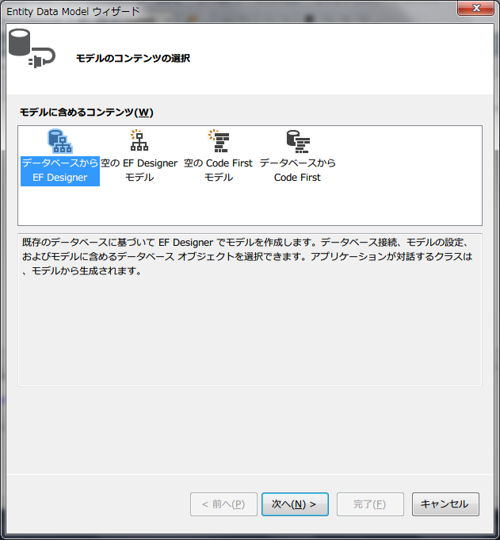
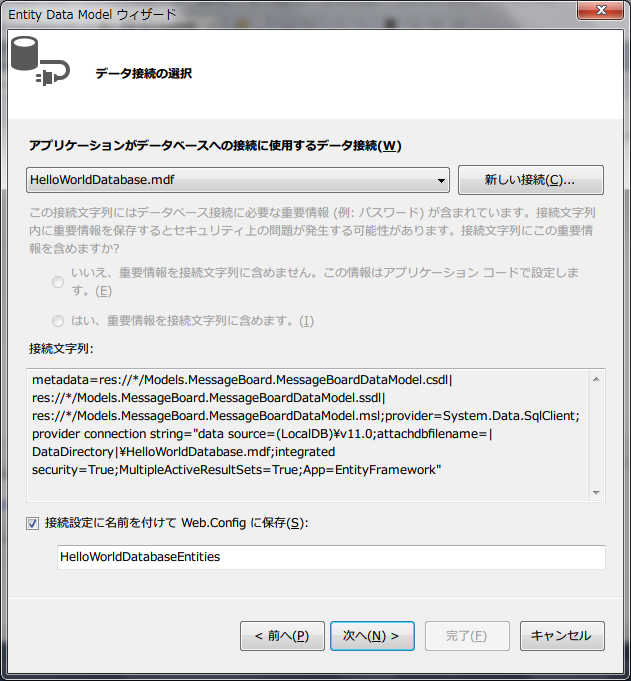

[author: murachi]
# Visual Studio Express 2013 for Web を使った Web 開発チュートリアル

## はじめに

このページは、 Microsoft Visual Studio Express 2013 for Web を使って Web 開発を行うまでの、ごく初歩的な内容を扱ったチュートリアルとなります。本ツールを初めて利用する初学者の学習に、ぜひお役立てください。

なお、 Visual Studio を用いた Web 開発では、さまざまな技術的選択肢が用意されておりますが、本記事では主に以下の技術を選択したものとして解説しています。何卒ご了承下さい。

* サーバーサイド Web アプリケーション言語: C#
* DBMS: Microsoft SQL Server
  * DBMS への接続方法: LINQ to Entity Data Model
* フレームワーク: ASP.NET MVC5
  * ビューエンジン: Razor
* クライアントスクリプト: JavaScript with JQuery

## セットアップ

まず、 2012 以降の Visual Studio は全てのバージョンで Windows Vista/7 以降のバージョンを求められます。 XP 以前の方は… 諦めるか、会社の偉い人に訴えて新しい PC を調達してもらうかして下さい。

[Visual Studio のダウンロードサイト](http:://www.visualstudio.com/ja-jp/downloads/download-visual-studio-vs.aspx)にて、「Visual Studio Express 2013 with Update 3 for Web」を選択し、日本語を選択して「今すぐインストール」からインストーラをダウンロードし、インストールを実行してください。

インストール、および実行には、 Microsoft アカウントでの認証が必要になる場合があります。アカウントを取った覚えがない方 (初めての方はないと思います…) は、アカウントを取得してください (無料ですが、メールアドレスが必要になります)。

### 事前にやっておくべきこと

Windows での開発全般に言えることですが、隠しファイルが非表示だったり、登録されている拡張子を表示しない設定だったりすると、色々と不便です。フォルダオプションで設定を直しておきましょう。 Vista/7 以降の Windows の場合、コントロールパネル→デスクトップのカスタマイズ→フォルダオプションから設定できるはずです。

Visual Studio Express 2013 for Web (以下、 Visual Studio と表記) を初めて起動したら、まずはじめに、メニューの「ツール」→「設定」→「上級者用の設定」を選択しましょう。こうすることで、このバージョンの Visual Studio にて提供されているすべての機能にアクセスできるよう、メニューやツールバーの配置などが変更されます。


最近の Visual Studio では、デバッグ時に使用する Web ブラウザを、主要なものから選択して起動することができるようになっています。 IE だけとは言わず、この際、ぜひさまざまなブラウザをインストールしてみてください。

* [Mozilla Firefox](http:://www.mozilla.org/ja/firefox/new/)
* [Google Chrome](https:://www.google.co.jp/chrome/browser/index.html)
* [Apple Safari](https:://www.apple.com/jp/safari/)
* [Opera](http:://www.opera.com/ja)

## プロジェクト新規作成

では早速、なにか作ってみることにしましょう。この手のツールは最初に作り始めるまでがとにかく長いですが、まぁ、気長に…。

Visual Studio を起動しましょう (まずはこれがそもそも時間がかかる場合があります… メニューが操作できなくても慌てず、気長に)。起動したら、メニューの「ファイル」→「新しいプロジェクト…」を選択します。


「新しいプロジェクト」ダイアログが開きます。画面左、インストール済みテンプレートのツリーから、「Visual C#」→「Web」を選択し、表示される項目の「ASP.NET Web アプリケーション」を選択しましょう。

名前は、そうですね… 初めてですし、「HelloWorld」とでもしておきましょうか。ソリューション名もおなじになるはずです。

場所は、あなたが覚えて置ける場所であれば、好きな場所で構いません。デフォルトではマイドキュメントの下のどこかになっているはずです。

「ソリューションのディレクトリを作成」はチェックを入れたほうがよいでしょう。「ソース管理に追加」は、とりあえずチェックを外しておいて下さい (あなたの仕事ではチェックを入れるように求められるかもしれませんが… とりあえずここでは不要です)。

以上を確認して「OK」ボタンを押しましょう。


次の画面に進みます。ここではテンプレートの選択や、単体テストの設定、認証の設定などを行います。

まず、「テンプレートの選択」にて、「MVC」を選択します。 MVC とは、プログラムをモデル (Model)、ビュー (View)、コントローラ (Controller) の 3つに分離した構造のことをいいます。

ちなみに、「Web Forms」というのがありますが、古くから ASP.NET を使って Web アプリ開発を行っている技術者であればこちらのほうが馴染み深いでしょう。 Web 部品を WYSIWYG な専用エディタでペタペタ貼り付けて画面作りができるお手軽さは良いのですが、昨今トレンドな Web アプリの開発には向かない要因が色々とあって、 Visual Studio を使わない Web アプリ開発技術者の多くに敬遠される要因にもなっていました。

「テンプレートの選択」で「MVC」を選択すると、その下の「以下にフォルダーおよびコア参照を追加:」の 3つあるチェックボックスのうち、「MVC」にチェックが付いたまま外せない状態になります。その両脇の「Web Forms」、「Web API」も選択することができますが、今回は使用しませんので、チェックは外したままにしましょう。

その下、「単体テストの追加」にチェックを入れると、ビジネスロジックの単体テストを記述するためのプロジェクトをソリューションに追加することができます。これは実際の開発ではぜひ使用するべきですが、今回は扱わないのでチェックは外しておいて下さい。

右側に行きましょう。認証の方法として、「個人ユーザー アカウント」と表示されています。これは、いわゆる Form 認証 (認証を行う Web ページを用意し、 Web アプリ内で認証をチェックするごく普通のやり方) を最初から実装してくれるというものです。今回は簡単のため、認証は使いませんので、設定を変えましょう。「設定の変更」ボタンをクリックして下さい。


「認証なし」を選択して「OK」ボタンをクリックします。ちなみに、「組織アカウント」は Active Directory を用いた認証方式、「Windows 認証」はいわゆる Windows 認証を使う方法です。

最後に、「クラウド内のホスト」チェックボックスを外します。 Microsoft が誇るホスティングサービス Windows Azure を使用するための設定項目なのですが、実際使うとしても配置の際に設定可能ですし、認証情報を入力しろと要求されて鬱陶しいだけです。

設定内容を確認して「OK」ボタンをクリックすると、プロジェクトのテンプレートが作成され、開発を開始できる状態になります。

## Hello, World

それでは早速動かしてみましょう。デバッグ実行でもいいのですが、メニューの「デバッグ」→「デバッグなしで実行」 (または Ctrl + F5 ショートカットキー) を選択すると、ビルドが実行され、ブラウザが起動し、ここまでで作成したテンプレートだけのウェブサイトの内容が表示されます。


ブラウザを選んで実行することもできます。ツールバーにブラウザ名 (最初はおそらく「Internet Explorer」となっているでしょう) が表示されている箇所がありますよね? その右端の小さい「▼」印をクリックすると、ブラウザの選択肢がドロップされます。


### 共通レイアウト

ブラウザを見てみましょう。 ASP.NET について色々と書かれたページが表示されています。ページの最上部に「アプリケーション名」、「ホーム」、「詳細」、「連絡先」と書かれたリンクボタンがあります。「アプリケーション」と「ホーム」は今表示しているページヘのリンクですが、のこり 2つは別のページヘのリンクです。それぞれクリックしてみましょう。「詳細」からは About ページに、「連絡先」からは「Contact.」ページに遷移します。

これら 3つのページで見た目が共通している部分があるのがわかるでしょうか? そう、ページ最上部のリンクボタンが並んでいる黒い部分と、ページ末尾の「&copy;2014」から始まる表示の部分です。これらは基本的にはサイト全体で共通するレイアウトとして使われている部分です。

Visual Studio を見てみましょう。ソリューションエクスプローラーのツリーが表示されていますね。 Web ブラウザー上での見た目の部分を定義しているファイルは、この中の「Views」フォルダーの中に収められています。その中の、「Shared」フォルダーを展開すると、中に「_Layout.cshtml」というファイルがあるので、ダブルクリックして開いてみましょう。このファイルが、共通レイアウトファイルで、この中のとある箇所に、そのページで実際に表示したい内容が挿入されたものが、 Web ブラウザーに送られて表示されるようになっています。

### ページを追加する

とりあえず共通レイアウトはそのまま放っておいて、まずは「Hello, World」を表示するためのページをこのサイトに追加してみましょう。それには以下の 2つの操作が必要です。

1. ビューのファイルを追加する
1. 該当するコントローラメソッドを追加する

#### ビューの追加

まず、ビューのファイルを追加します。ソリューションエクスプローラーにて、ツリーの「View」→「Home」フォルダを右クリックしてみてください。


コンテキストメニューにて、「追加」→「ビュー」を選択します。


ビュー名は「Hello」とでもしておきましょう。

テンプレートは「Empty (モデルなし)」のままで ok です。

オプションの「部分ビューとして作成」はチェックを外しておきます。このオプションは、このビューを他のビューの一部分として使用する場合に使用します。単独のページとして使用する場合はチェックを入れません。

「レイアウトページの使用」は、まさに先ほど紹介した「_Layout.cshtml」を使用するかどうかということです。これはチェックを入れておきます。その下の空欄はレイアウトページに使用するファイルを指定するものですが、そのさらに下にある但し書きの条件にまさに合致するケースになりますので、ここは空欄にしておきます。

「追加」ボタンを押すと、 View/Home フォルダの下に、 Hello.cshtml というファイルが追加され、そのファイルがエディタで開いた状態になります。コードは以下の様な内容になっているはずです。

```text
@{
    ViewBag.Title = "Hello";
}

<h2>Hello</h2>
```

`@{` ～ `}` の中には、サーバーサイドで実行する C# のコードを書きます。ここでは、変数 `ViewBag` が持つオブジェクトの `Title` フィールドに、文字列 `"Hello"` を代入しています。実はこの `ViewBag.Title` は、先に見た共通レイアウトファイル「_Layout.cshtml」の中で参照していて、そのままページのタイトルとして使用されています。

つまり、この部分を、

```text
@{
    ViewBag.Title = "Hello, World";
}
```

に置き換えてしまえば、そのままページのタイトルも「Hello, World」に置き換わるというわけです。

そのあとの HTML っぽく書かれた行は、まさにこのページに出力する HTML そのものです。なのでここも、

```text
<h2>Hello, World</h2>
```

としてしまえば、ページにもそのまま「Hello, World」が表示される、ということになります。

#### コントローラメソッドの追加

次の段階に進みましょう。ページを追加する際、そのページに相当するビューを追加したら、そのビューに対応するコントローラメソッドを追加して上げる必要があります。コントローラは何をするところかというと、ページに表示すべき情報をビューが扱いやすいように直したり、ユーザー操作によって追加または変化する情報 (フォーム入力とかクッキーとか) に応じて何らかの処理を行ったり、といったようなことを行います。

今回、ビューは Home フォルダの下に Hello という名前で追加したので、対応するコントローラメソッドは `HomeController` クラスの `Hello` メソッドということになります。まず、 `HomeController` クラスが書かれたファイルを開きましょう。ソリューションエクスプローラーのツリーにて、「Controllers」フォルダを展開すると、 HomeController.cs ファイルが存在するので、このファイルをダブルクリックしてエディターにて開きます。


ファイルの内容は以下のようになっているはずです。

```cs
using System;
using System.Collections.Generic;
using System.Linq;
using System.Web;
using System.Web.Mvc;

namespace HelloWorld.Controllers
{
    public class HomeController : Controller
    {
        public ActionResult Index()
        {
            return View();
        }

        public ActionResult About()
        {
            ViewBag.Message = "Your application description page.";

            return View();
        }

        public ActionResult Contact()
        {
            ViewBag.Message = "Your contact page.";

            return View();
        }
    }
}
```

純然たる C# プログラムです。 C# 自体の経験がない方のために解説すると、最初の "using" で始まる行は、ライブラリを使用しやすくするために名前空間を展開する宣言です。例えば、ここに

```cs
using System.Text;
```

という行を加えると (今回は加えなくてもいいですよ)、文字列を少しずつ繋いで生成していくためのライブラリクラス [`System.Text.StringBuilder`](http:://msdn.microsoft.com/ja-jp/library/system.text.stringbuilder%28v=vs.110%29.aspx) を、単に `StringBuilder` と書くだけで使用できるようになります。

次に `namespace` で始まる行は、こういう名前の名前空間を作るよ、という宣言です。つまり、この後定義されている `HomeController` クラスの本当の名前は、ここで宣言した名前空間の名前を手前につないだ `HelloWorld.Controllers.HomeController` ですよ、ということになるわけです。

名前空間という言葉がここまでに何回か出てきましたが、この概念の存在意義については自分で調べてみましょう。大雑把に言ってしまえば、要するに名前の衝突を防ぐための仕組みであるということになります。

`public class` で始まる行が、ここで作ろうとしているクラスの宣言です。 `HomeController` がこのクラスの名前で、コロン `:` を挟んで後ろにある `Controller` というのは、このクラスが継承する基底クラスになります。これはつまり、 `HomeController` クラスは、 `Controller` クラスが持つ機能をそのまま継承して実装されるよ、というような意味合いになります<small> (この `Controller` というクラスがどんな機能を提供してくれているのかについては、 MSDN Library では[この辺](http:://msdn.microsoft.com/ja-jp/library/system.web.mvc.controller%28v=vs.118%29.aspx)に記述されています。) </small>。

`public ActionResult` で始まる行は、このクラスに所属するメソッドです。 ASP.NET MVC のコントローラクラスでは、この中に実装されるメソッドが、ユーザーが Web サイトにアクセスした際に実際に呼ばれる処理そのものとなります。とりあえず、先ほど追加した Hello ビューに対応するコントローラメソッドを追加したいので、ここにある `Index` メソッドの実装を参考に、以下のように `Hello` メソッドを追加してみてください。

```cs
        // これの真似をして
        public ActionResult Index()
        {
            return View();
        }

        // こんなふうに書く
        public ActionResult Hello()
        {
            return View();
        }
```

#### 動かしてみる

とりあえずここまでで準備は完了です。それでは、エディタのタブを切り替えて、ビューのファイル Hello.cshtml を表示した状態にした上で、 Ctrl + F5 キーを押して実行してみましょう。ビルドが実行され、下の図のような画面がブラウザ上で表示されたならば、成功です。


#### 失敗する場合

うまく行きませんか? どんな症状になるでしょう?

* ビルドに失敗する場合

実行しようとしたら以下の様なダイアログが表示されましたか?


だとすれば、コントローラメソッドの記述で文法上のエラーなどが発生している可能性が高いです。「いいえ」をクリックしてダイアログを閉じ、 HomeController.cs ファイルを開いてエラーのある箇所を修正しましょう。

Visual Studio の画面下にエラー一覧があり、そこにエラーの内容がリストアップされているかもしれません。


隠れていて表示されていない場合は、上図で赤い丸で囲った辺りをクリックしてみてください。

もし、エラーが有るなら、そのエラーの内容をダブルクリックしてみましょう。実際にエラーになっている箇所にカーソルが移動するはずです。エラーの文面をヒントに、修正を試みてください。

* サーバーエラーが発生した場合

ビルドは通ってブラウザは起動したけど、 Hello, World とは表示されず、代わりに下図のようなエラー画面が表示されてしまった。


…のであれば、これはビューの名前とコントローラメソッドの名前が一致していないのが原因です。

ASP.NET MVC では、指定された URL の名前に相当する名前のビューとコントローラが選択されることになっています。ブラウザの URL 欄に表示されている URL を確認してみましょう。以下の様な URL になっているはずです。

```
http://localhost:(ポート番号)/Home/Hello
```

ここで、 Web サーバーのルートから見て、参照しようとしているリソースのパスは「Home/Hello」となりますよね? このとき、 Web サーバーが呼びだそうとするビューファイルとコントローラメソッドの名前は、以下の通りとなるのです。

* ビューファイル: (ビューのルートディレクトリ)\\__Home__\\__Hello__.cshtml
  * Visual Basic プロジェクトの場合、拡張子は .vbhtml
* コントローラメソッド: __`Home`__`Controller` クラスの __`Hello`__ メソッド (__`Home`__`Controller.`__`Hello`__)

もし、このどちらかが存在しない場合、実行時にサーバー内にてエラーが発生し、そのエラーの内容がブラウザに伝えられます。特に、上図で示したような「リソースが見つかりませんでした」というエラーは、コントローラメソッドが存在しない (つまり、名前が間違っている) 場合に発生します (コントローラメソッドは見つけたけどビューファイルが見つからない場合には、もうちょっと違う内容のサーバーエラーになります)。 HomeController.cs ファイルを開き、追加したメソッドの名前を確認し、修正しましょう。

### 追加したページヘのリンクを張る

さて、色々と試行錯誤していると気づいてしまっているかもしれませんが、 Visual Studio のエディタで Hello.cshtml ファイルを開いている時に Ctrl + F5 キーを押した場合は Hello, World のページが表示されますが、例えば HomeController.cs ファイルを開いている時に Ctrl + F5 キーを押した場合、一番最初に実行した時のあのホーム画面


が表示されてしまいますよね。

Hello, World のページを表示してみたいのに、実行するたびにいちいち Visual Studio のエディタで Hello.cshtml ファイルを表示させてから Ctrl + F5 とか、なんだか面倒くさいですよね。どのみちこのサイトにアクセスした人が Hello, World ページを閲覧するために URL を教えてもらって直打ち…というわけにも行かないでしょうから、ページのどこかにリンクボタンを置いて、 Hello, World ページヘのリンクを張ってあげる必要があります。

HTML では、リンクボタンは `<a>` タグで設置できますよね。 ASP.NET MVC でも、この `<a>` タグを使って任意のページヘのリンクを設置することができます。 Hello, World のページの (ホスト名を含まない) URL は `/Home/Hello` ですから、どこかのビュー (Home\Index.cshtml など) に、以下の行を書き加えてあげれば、それが Hello, World ページヘのリンクボタンになるはずです。

```text
<p>
    <a href="/Home/Hello">Hello, World のページヘ</a>
</p>
```

実際これでもいいのですが…、実は ASP.NET MVC 的にはもっと推奨された書き方が用意されています。ブラウザへの出力結果は上記と同じになりますが、以下のように記述します。

```text
<p>
    @Html.ActionLink("Hello, World のページヘ", "Hello", "Home")
</p>
```

3つ目の引数 `"Home"` は、同じ Home ディレクトリ内のビューファイルにて記述するのであれば、省略することも可能です。

順を追って解説しましょう…。まず、 `@` で始まる記述箇所は、 C# のコードを記述することを表すものです。 `Html` はここで使えるオブジェクトの名前で、 HTML 関連の処理を行うメソッドが色々と用意されているというものです。このオブジェクトの `ActionLink` メソッドを呼び、その結果をこの位置に出力する、という意味になります。

`ActionLink` メソッドの公式の MSDN Library ドキュメントは[ここにあります](http:://msdn.microsoft.com/ja-jp/library/system.web.mvc.html.linkextensions.actionlink(v=vs.118).aspx)。実はもっといろんな引数の指定方法があるのですが (同じ名前の関数に複数の引数指定のバリエーションを持たせることを関数の**オーバーロード**と言います)、とりあえず、

* 1つ目の引数に、リンクボタンとして表示する文字列を指定する。
* 2つ目の引数と 3つ目の引数で、リンク先の URL が決定する。
  * 同じディレクトリにあるページヘリンクを張る場合、 3つ目の引数は省略可能。

なお、この時指定する 2つ目の引数と 3つ目の引数は、それぞれ**アクション名**と**コントローラ名**と呼ばれています。実際の URL も、

```
http://ホスト名/コントローラ名/アクション名
```

と考えることができます。

説明が長くなってしまいました。それでは実際にリンクを張ってみましょう。まず、ビューファイル View\Home\Index.cshtml を開きます。


…なんだか色々と書かれていますが、別にいらない情報でしょうから、 HTML で書かれている部分は全部消してしまいましょう。ファイルの内容を以下のように書き換えてしまってください。

```text
@{
    ViewBag.Title = "Home Page";
}

<p>
    @Html.ActionLink("Hello, World のページヘ", "Hello", "Home")
</p>
```

ここまで書いたら、 Ctrl + F5 を押して実行してみましょう。下図のような画面が表示されましたか?


「Hello, World のページヘ」と書かれたリンクボタンをクリックしてみてください。これで、 Hello, World のページヘ遷移できたならば、成功です。

### もっと Web アプリらしいことをしてみよう

Hello, World を表示することには成功しましたが、ここまででやっていることといえば、単に HTML ファイルを書いてブラウザに読み込ませているのと殆ど変わりません。本来であれば、何らかの処理を経て得られたデータを Web ページに表示する、ぐらいのことはやってみたいところでしょう。

そこで、その「何らかの処理」を書くべき場所から Hello, World という文字列を取り出し、それを表示に適用する、という Web アプリらしいプログラムを書いてみることにしましょう。

#### MVC アーキテクチャ

「何らかの処理」を書くべき場所とは、実際には業務内容に応じて必要となる処理、すなわちシステムへの要件そのものに対応する本質的な部分ということになります。そのような処理のことを、一般的には**ビジネスロジック**と呼ばれています。そして、ビジネスロジックを書くべき場所のことを、 MVC アーキテクチャにおける**モデル**といいます。

モデルに書かれたビジネスロジックの処理によって得られた結果をコントローラが整形し、ビューで表示する。または、ユーザーが操作を行うための UI をビューに設け、その操作をコントローラが受け付けて処理内容をモデルに指示し、モデルにおけるビジネスロジックが最終的な処理を行う。 MVC アーキテクチャとは、そのようにシステムの役割を 3つのレイヤーに分けて記述する設計手法のことなのです。

ASP.NET MVC では、ビューは Views フォルダ下に HTML っぽいファイルとして、コントローラは Controllers フォルダ下にある C# コードで書かれたクラスのメソッドとして、それぞれ記述しました。モデルもこれらと同様に、 Models フォルダの下の任意のフォルダ階層に、 C# で記述することができます。ただし、ビューやコントローラとは違い、これらの名前に合わせる必要は全くなく、あくまで業務要件の都合に応じた好きな名前でクラスやメソッドを実装してしまって構いません。

#### Hello, World と返すモデル

そんなわけで、 Hello, World という内容のデータを取り出すことができるモデルを作ってみましょう。 Models フォルダの直下に C# ファイルを作ってしまっても良いのですが、業務内容を整理しやすくするため、サブフォルダを切ってからにしましょうか。まず、 Models フォルダを右クリックし、「追加」→「新しいフォルダー」を選択します。


サブフォルダの名前は「SmallCase」とでもしておきましょう。次に今作ったフォルダを右クリックし、「追加」→「クラス」を選択します。


「新しい項目の追加」ダイアログが表示されます。「クラス」が選択されていることを確認して下さい。ファイル名は、「HelloWorld.cs」としましょう。

「OK」ボタンをクリックすると、 SmallCase フォルダの下に HelloWorld.cs ファイルが生成され、エディタで開いた状態になります。ファイルの内容は以下の通りになっているはずです。

```cs
using System;
using System.Collections.Generic;
using System.Linq;
using System.Web;

namespace HelloWorld.Models.SmallCase
{
    public class HelloWorld
    {
    }
}
```

名前空間 (`namespace` で始まる行で宣言されている名前ですね) の最後が `SmallCase`、クラス名が `HelloWorld` となっています。よくできてますねー。

それではこのクラスに、 Hello, World という文字列を返す**プロパティ**を追加してみましょう。プロパティとは、フィールド (メンバ変数) のように操作できるけど、その実態はメソッドのように振る舞いを持つ、というものです。今回は `get` のみを定義した読み取りアクセスのみ可能なプロパティを定義します。以下のように書いてください。

```cs
    public class HelloWorld
    {
        // Hello, World を返す Text プロパティ
        public string Text
        {
            get
            {
                return "Hello, World";
            }
        }
    }
```

こう書くことによって、このクラスのオブジェクトを使用する側のプログラムでは、以下のように書くことができます。

```cs
var hw = new HelloWorld.Models.SmallCase.HelloWorld();
var output_text = hw.Text;  // "Hello, World" をここで取得
```

C# に慣れていない人のために順を追って解説しましょう。まず、 `var` という修飾子は、ここで定義する変数の型を推測することを意味します。**型推論**はコンパイル時に行われ、代入しようとする値と同じ型の変数であるとみなされます。つまり、上記のコードは以下のコードと本質的には同じ意味です。

```cs
HelloWorld.Models.SmallCase.HelloWorld hw = new HelloWorld.Models.SmallCase.HelloWorld();
string output_text = hw.Text;
```

なんでこう書かないのかというと、 2回も `HelloWorld.Models.SmallCase.HelloWorld` などという長ったらしい名前を書くのはさすがに冗長すぎるからです…。

次になぜ `Text` プロパティをわざわざプロパティとして実装したかというと、仮に単なるフィールドとして実装した場合、

```cs
   public class HelloWorld
   {
       // Text をフィールドとして実装した場合
       public string Text = "Hello, World";
   }
```

呼び出し側のプログラムで、このフィールドを書き換えることができてしまいます。今回のケースはともかく、こうした使われ方はビジネスロジックの設計者にとっては意図していないものである可能性があります。

```cs
var hw = new HelloWorld.Models.SmallCase.HelloWorld();
hw.Text = "Gooby, Past";    // Hello, World じゃなくなっちゃった…。
```

本質的には C# のプロパティはメソッドの構文糖衣に過ぎません。プロパティでできることは全てメソッドでも実現可能です<small> (デスクトップアプリケーション作成で WPF を使う場合にビューモデルオブジェクトをビューにバインドする際、バインドするステータスは変数のようにアクセスできる必要があるという仕様があって、そういうケースではメソッドで代用できる必要がある、といったような例外はありますが…。) </small>。とはいえ、プロパティを用いることでプログラムの表現がより直感的になるケースも多いですし、 C# では広く使われている書き方ですので、この際知っておくといいと思います。

#### モデルデータをコントローラがビューに渡す

モデルが出来上がりましたので、次はこのコードを呼び出して取り出したデータをビューに渡すコントローラのコードを書きましょう。コントローラの HomeController.cs ファイルを開いてください。

まず、使用するモデルの名前空間にアクセスしやすいように、名前空間のショートカット名を宣言しましょう。ファイル先頭の `using` で始まる行の並びに、以下の行を追加します。

```cs
using sc = HelloWorld.Models.SmallCase;
```

次に、以前追加した `HemoController.Hello` メソッドに、以下のコードを記述します。

```cs
        public ActionResult Hello()
        {
            var hw = new sc.HelloWorld();
            ViewBag.Hello = hw.Text;

            return View();
        }
```

`HelloWorld` クラスインスタンスの生成で、

```cs
            var hw = new HelloWorld.Moels.SmallCase.HelloWorld();
```

と書かずに済んだのは、その前に書いた `using` 行のおかげです。ただ、今回の例では名前空間のショートカット名はあまりにも短くしすぎてわかりづらいかもしれません。この辺は、ある程度は開発チーム内で命名規則を決めておいたほうがよいかもしれません。

次の `ViewBag` は先程も出てきましたが、コントローラとビューの間でデータのやり取りをする際に使用する最も手っ取り早い手段の一つで、このオブジェクトには好きな名前のフィールドを作ってデータを放り込むことができるようになっています。放り込めるデータの型も、ある程度制限はありますが、割となんでも放り込めるようです。

```cs
ViewBag.Name = "Toshiyuki Murayama";  // 文字列
ViewBag.Born = new Date(1978, 2, 7);  // 日付
ViewBag.Tall = 166.2;                 // 数値

ViewBag.Hello = new sc.HelloWorld();  // モデルオブジェクトも入れようと思えば入れられる
```

#### 受け取った値を表示するコードをビューに書く

それではいよいよ受け取った値を表示するコードを書きます。今度はビューの Home\Hello.cshtml ファイルを開いてください。

今までと同じ表示結果では面白く無いので、既にある `<h2>` タグの行の下に、新しく以下の行を付け加えましょう。

```text
<h2>Hello, World</h2>

<p>モデルから受け取った値: <strong>@ViewBag.Hello</strong></p>
```

説明の必要はないかもしれませんが一応解説すると、 Razor 記法により、 `@ViewBag.Text` と書かれた場所には、 C# 言語での `ViewBag.Text` を評価して得られる値が HTML 出力されます<small> (これが `string` 型の文字列の場合、正確には **HTML エスケープ処理されてから出力**されます。つまり、入っている文字列値がそのままブラウザ上に表示されるということです。) </small>。つまり、うまく行けばこの部分は以下のように HTML 出力されるはずです。

```text
<h2>Hello, World</h2>

<p>モデルから受け取った値: <strong>Hello, World</strong></p>
```

それでは、 Ctrl + F5 キーを押して、実際どのように動くか見てみましょう。以下のように表示されれば成功です。


## 掲示板を作ってみよう

Hello, World だけでは面白く無いので、もっと Web アプリらしいものを作ってみましょう。掲示板は基本中の基本ですから、練習には持って来いでしょう (多分…)。

まずは機能要件を整理しましょう。ざっと以下の通りでしょうか…。

* 認証とかは設けない。ていうか、これまでに作っていたプロジェクト環境の中で作ってしまうことにする。
* ユーザーが入力するのは、名前とコメントのみ。
  * どちらかが未入力の場合は、エラーとする。
* 一度に表示するコメントは 10件までとし、新しいコメントから順に表示する。古いコメントはページを切り替えて表示できるようにする。
* コメントの表示内容は、投稿者名と日時、コメント本文。コメント本文は入力されたとおりにそのまま表示する<small> (HTML とか Wiki フォーマットとかで装飾表示はしないということ。) </small>。

CSRF などの迷惑行為につながる脆弱性対策は考慮しませんので、今回のチュートリアルで作ったものをそのままインターネット上に公開することはお控えください。あくまでご家庭の LAN 内でお楽しみいただく程度に止めていただければと思います。

### データベースを作成する

掲示板に書き込まれるデータはどこかに保存しなければなりません。ファイルに保存とかでもいいのですが… 普通に Microsoft SQL 使いましょう。

#### データベースファイルを追加する

まず、プロジェクトにデータベースファイルを追加する必要があります。データベースファイルは、プロジェクトの App_Data フォルダ下に作成します。ソリューションエクスプローラーのツリーにて、App_Data フォルダを右クリックしてみてください。


コンテキストメニューにて、「追加」→「新しい項目」を選択します。


「新しい項目の追加」ダイアログが表示されます。画面左側、インストール済みの項目から「データ」を選択し、画面中央に表示されるアイテムの中から「SQL Server データベース」を選択します。

名前は、「HelloWorldDatabase.mdf」としておきましょう。

「追加」ボタンをクリックすると、下図のように、 App_Data フォルダ下にデータベースファイルが追加されます。


#### データベースにテーブルを追加する

次に、データベース内で実際にデータが格納されるテーブルを作成するのですが、その前に、掲示板で使用するデータベーステーブルについてレイアウトを考える必要があります。

今回は認証もなく、スレッドを分けたりといったことも考慮しないので、コメントを保存するテーブルが 1つだけあれば事足りるでしょう。テーブルの仕様は以下の通りとします。

* テーブル名: MessageBoardTable
* フィールド:
  * MessageNum ... ユニークな通し番号 (int型, Primary Key, NULL 非許容)
  * Author ... 投稿者名 (nvarchar型 32文字まで, NULL 非許容)
  * PostDateTime ... 投稿日時 (datetime2型, NULL 非許容)
  * Detail ... メッセージ内容 (Text型, NULL 非許容)


それでは、実際にテーブルを追加してみましょう。 Visual Studio にてサーバーエクスプローラを開き、ツリー表示の「データ接続」配下にある「!HelloWorldDatabase.mdf」を選んで、その左端にある「&#9657;」マークをクリックします。すると、データベースに接続された状態となり、ツリーが展開されます。


ここで、「テーブル」フォルダを右クリックし、「新しいテーブルの追加」を選択しましょう。


するといきなり、上図のような、テーブルレイアウトを設計する画面が表示されます。画面は上下に分かれていて、上がテーブルレイアウトのデザインを表示・編集する領域、下は、テーブルを実際に生成する際に使用する CREATE TABLE ステートメントの SQL 文<small> (よく DDL と呼ばれているものですね。) </small>自体を表示・編集する領域となっています。

まず、テーブル名を設定する必要がありますが、それは SQL 文を直接編集することによって行います。 SQL 文の

```sql
CREATE TABLE [dbo].[Table]
```

となっている行を、

```sql
CREATE TABLE [dbo].[MessageBoardTable]
```

と修正してください。

SQL に詳しい方であれば、このままフィールドの定義も SQL 文に直接書き加えていっても構わないのですが、こちらは画面上の方で入力しましょう。まず、 1行目の Id フィールドは名前を MessageNum に変更します。 2行目は名前を Author 、データ型を nvarchar(32) 、そして「Null を許容」の列のチェックを外します。

このような要領で、テーブルレイアウトのデザインを、以下の表のとおりになるように入力してください。

| 鍵マーク | 名前 | データ型 | Null を許容のチェック | 規定 |
|---|---|---|---|---|
| 付ける | MessageNum | int | 外す |  |
|  | Author | nvarchar(32) | 外す |  |
|  | PostDateTime | datetime2(7) | 外す | SYSDATETIME() |
|  | Detail | text | 外す |  |

デザイン情報を入力していくと、 SQL 文の方も変更に応じて自動的に書き換わっていきます。よくできてますねー。

最後に、 MesageNum は自動的に通し番号を設定するようにしたいので、 SQL 文にて、

```sql
	[MessageNum] INT NOT NULL PRIMARY KEY,
```

となっている行を、以下のように修正してください。

```sql
	[MessageNum] INT IDENTITY(1,1) NOT NULL PRIMARY KEY,
```

以上でテーブルレイアウト定義は完成です。最終的に SQL 文は以下の通りになっているはずです。

```sql
CREATE TABLE [dbo].[MessageBoardTable]
(
	[MessageNum] INT NOT NULL PRIMARY KEY,
    [Author] NVARCHAR(32) NOT NULL,
    [PostDateTime] DATETIME2 NOT NULL DEFAULT SYSDATETIME(),
    [Detail] TEXT NOT NULL
)
```

それでは、画面左上の「更新」をクリックして、テーブル定義をデータベースに適用しましょう。


「データベース更新のプレビュー」ダイアログが表示され、データベースへの操作内容が表示されます。内容を確認し、「データベースの更新」ボタンをクリックしてください。これで、実際にデータベースに対して操作が行われ、テーブルが追加されます。テーブルの追加は、サーバーエクスプローラ上にて「テーブル」フォルダを展開することで確認できます。


### モデルを実装する

データベースの準備ができたので、次にモデルを実装します。まず、データベースにアクセスするための準備として、 Entity Data Model オブジェクトを追加します。

その前に、掲示板用のモデル実装をまとめておいておくフォルダを作っておきましょう。ソリューションエクスプローラーを開いて、 Models フォルダの下に MessageBoard フォルダを追加してください。やり方は覚えてますか?

そうしたら、今作った MessageBoard フォルダを右クリックし、コンテキストメニューから、「追加」→「新しい項目」を選択します。(もうコンテキストメニューの画像はいらないですよね?)


画面左側にて「データ」カテゴリを選択し、画面中央の一覧から「ADO.NET Entity Data Model」を選択します。名前は、 MessageBoardDataModel とでもしておきましょう。

「追加」ボタンを押してください。



すると次に、「Entity Data Model ウィザード」ダイアログが表示されます。

「モデルに含めるコンテンツ」ですが、今回はデータベースのテーブル定義を先に行ったので、これを基に Entity Data Model を自動生成します。「データベースから EF Designer」を選択してください。「次へ」をクリックします。



接続するデータベースを選択する画面になります。「HelloWorldDatabase.mdf」が選択されていることを確認してください。「接続設定に名前をつけて Web.Config に保存」もチェックを入れた状態にしておきます。「次へ」をクリックしてください。


Entity Framework のバージョンを選択する画面になります。最新の Entity Framework 6.0 を使いたい場合は事前にアップグレードしておかないといけなかったのですが、今回は 5.0 でも別に構わないので、そのまま「次へ」をクリックします。


データベースオブジェクトと設定を選択する画面になります。「モデルに含めるデータベースオブジェクト」の「テーブル」ツリーを展開し、先ほど作ったテーブル「MessageBoardTable」が含まれていることを確認して、チェックを入れてください。

その他の項目は特にいじらずに、「完了」をクリックします。


しばらく処理が走ったあと、「セキュリティ警告」ダイアログが表示されます。あまり深く考えずに「OK」をクリックしてしまって構いません。このダイアログは、何回か表示される場合があります。


モデルの生成に成功すると、上図のようなダイアグラムが表示されます。これで Entity Data Model の準備が整いました。
