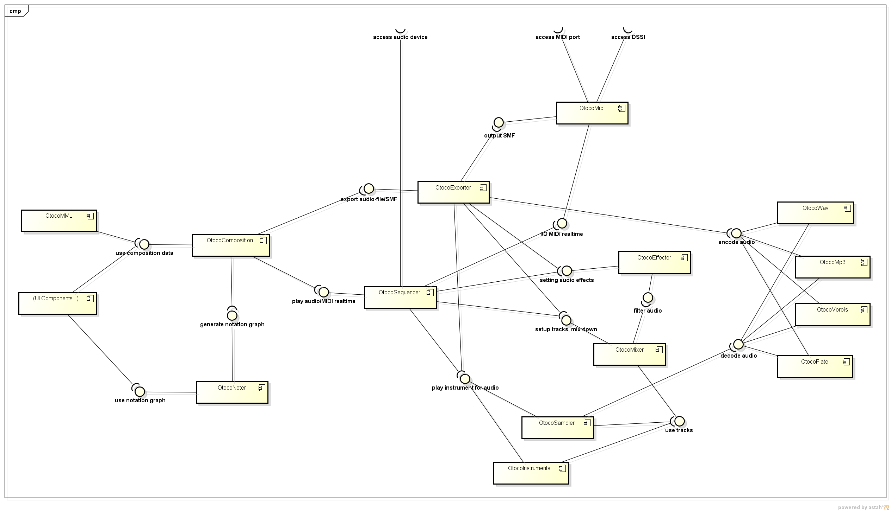
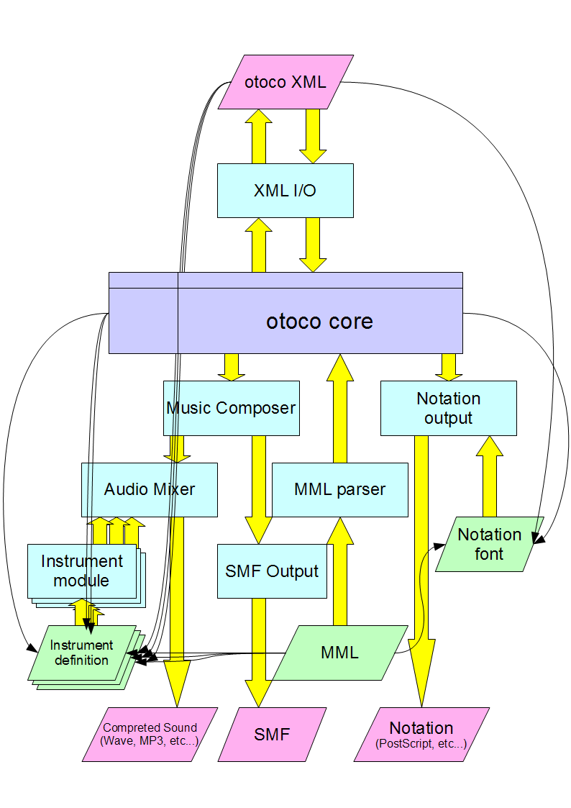
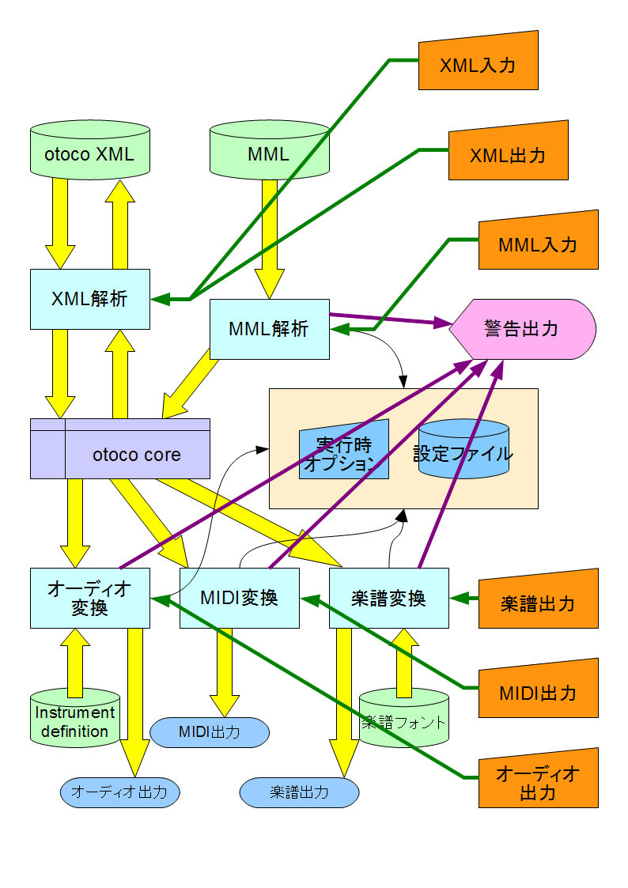

[author: murachi]

# システム構成仕様

<h2 id="modules">モジュール</h2>

otoco システムを構成するモジュールの依存関係を、以下のコンポーネント図に示す。

<h3 id="mo-composition">OtocoComposition</h3>

楽曲データを構成するデータ構造を扱うモジュール。また、 UI と連携し、再生、エクスポート等の操作を受け付ける。本システムの中核となるコンポーネント。

以下の機能を提供する。

* 楽曲データの作成、編集、参照。
* 楽曲データの XML シリアライズ。
* UI との連携 (操作の受付、ログ出力等)。

<h3 id="mo-exporter">OtocoExporter</h3>

演奏情報を SMF やオーディオファイルへエクスポートする処理を主導するモジュール。

SMF へのエクスポート処理は、実質的には [OtocoMidi](#mo-midi) モジュールに委託する。

オーディオファイルへのエクスポート処理では、 [OtocoSequencer](#mo-sequencer) モジュールと同様の方法で演奏をシミュレートし、 [OtocoMixer](#mo-mixer) モジュールにて各トラックにため込まれたオーディオ情報をミックスダウンしたものを、指定されたオーディオエンコーダモジュールを使用してエンコード処理を施し、ファイルに保存する。

<h3 id="mo-sequencer">OtocoSequencer</h3>

リアルタイムで演奏を行うモジュール。

シーケンサとして動作し、 [OtocoComposition](#mo-composition) モジュールが持つ楽曲データに則って [OtocoMidi](#mo-midi) モジュールや [OtocoEffecter](#mo-effecter)、 [OtocoSampler](#mo-sampler)、 [OtocoInstruments](#mo-instruments) 各モジュールに逐次演奏指示を与える。

[OtocoMidi](#mo-midi) モジュールから MIDI-IN を受け付けるトラックを設定できる。リアルタイムレコーディングモード時には、設定したトラックに対して [OtocoComposition](#mo-composition) モジュールが持つ楽曲データを適宜書き換える。

<h3 id="mo-midi">OtocoMidi</h3>

演奏情報と MIDI 信号との相互変換と、 MIDI I/O を扱うモジュール。

エクスポート処理に際しては、 SMF への出力までを担う。

<h3 id="mo-mixer">OtocoMixer</h3>

オーディオミキサーモジュール。複数のオーディオトラックを持ち、エフェクターモジュールと連携してリアルタイムミキシング、またはミックスダウンを行う。

リアルタイムミキシング時の動作は、MIDI との同期を確実なものにするためにも、本当にその場でならすイメージではなく、事前にミックスダウンされた音を用意してストリーミング再生するイメージで実装する。

<h3 id="mo-instruments">OtocoInstruments</h3>

楽器モジュール。楽器スクリプトによって波形を生成し、オーディオトラックに音色を提供する。楽器スクリプトは楽曲データの中に含めることも、楽曲データとはファイルを別個にすることも可能とする。

<h2 id="data-flow">データの流れ</h2>

データの流れ図を以下に示す。

長方形は処理、菱形はデータ、中央のテーブルのような罫線が入った矩形は内部データ。

データは緑色がユーザーが用意する入力データ、ピンクが生成される出力データ。

まず、コアとなる内部データの形式があり、処理はこの内部データに基づいて行う。

内部データは、MML を MML Parser に通す事によって生成される。XML は内部データをそのまま表現するものとして、内部データと相互に入出力可能とする。

出力データは大きく分けて、演奏データと楽譜データに分けることができる。

演奏データは Music Composer 処理によって出力される。Music Composer 処理は、 UI からの操作により、出力に SMF Output 処理を用いるか、 Audio Mixer 処理を用いるかを決定する。

SMF Output 処理を用いた場合、SMF (MIDI) が出力される。この場合、ソースデータは core のみで完結する。

Audio Mixer 処理を用いた場合、サウンドデータが出力される。サウンドのファイル形式は Wave, MP3 等が考えられるが、他のツールやデバイスにパイプする等の利用も想定される為、ここでは特に規定しないことにする。 Audio Mixer 処理はサウンドの生成に Instrument Module 処理を利用する。 Instrument Module はその名の通り楽器として機能する処理のモジュールであり、同一のインタフェース方式を介して複数のモジュールがプラグインのように扱われることを想定している。 Instrument definition は Instrument Module の動作を規定する定義ファイルである。これらは core から参照される (すなわち、ファイルのパスが指定される)。

楽譜データは Notation output 処理によって出力される。楽譜データのファイル形式は基本的には PostScript のみとなる (将来この仕様は変更になる可能性がある)。楽譜に描画する記号には外部データを利用する。この外部データが Notation font であり、これも Instrument definition 同様、 core から参照される。

<h2 id="ui-to-io">UI と I/O の対応</h2>

UI と I/O の対応図を以下に示す。

オレンジ色の台形はユーザーによる操作を示す。長方形は実際の処理、円柱はファイルを示す。黄色い矢印はデータの流れを示すのに対し、緑色の矢印はユーザー操作がどの処理を呼び出すのかを示す。黒くて細いコネクタは処理が情報を参照する参照先を示し、赤紫色の矢印は副次的な情報 (ログ、警告等) の流れを示す。

MML 解析や、各種の変換出力処理においては、実行時オプションおよび設定ファイルを参照し、警告の出力を行う。

実行時オプションの受け渡しは、各処理のモジュールが呼び出し側にインターフェースを提供するものとする。

設定ファイルは共通のものとし、ファイル内でどの処理に対する設定なのかが切り分けられるような構造を取る。

警告出力はコールバック関数として実装する。すなわち、出力される警告を扱う処理を呼び出し側が提供する。

XML 解析処理においては、設定ファイルの参照や警告出力は行わない。XML 入力時に解析エラーがあった場合は、呼び出し側に、エラーの箇所と内容を含めた結果を返す (あるいは例外を送出する) のみとなる。

各種の変換出力処理においては、出力先を規定しないが、実際には出力先のファイルパスを指定してファイルを保存することもできるようにする。出力先のパスを指定しなかった場合、出力されるデータはそのままメモリー上で受け渡される。特に、オーディオ出力、MIDI出力においては、ストリーム再生が可能となるようなインタフェースが提供されることが望ましい。
